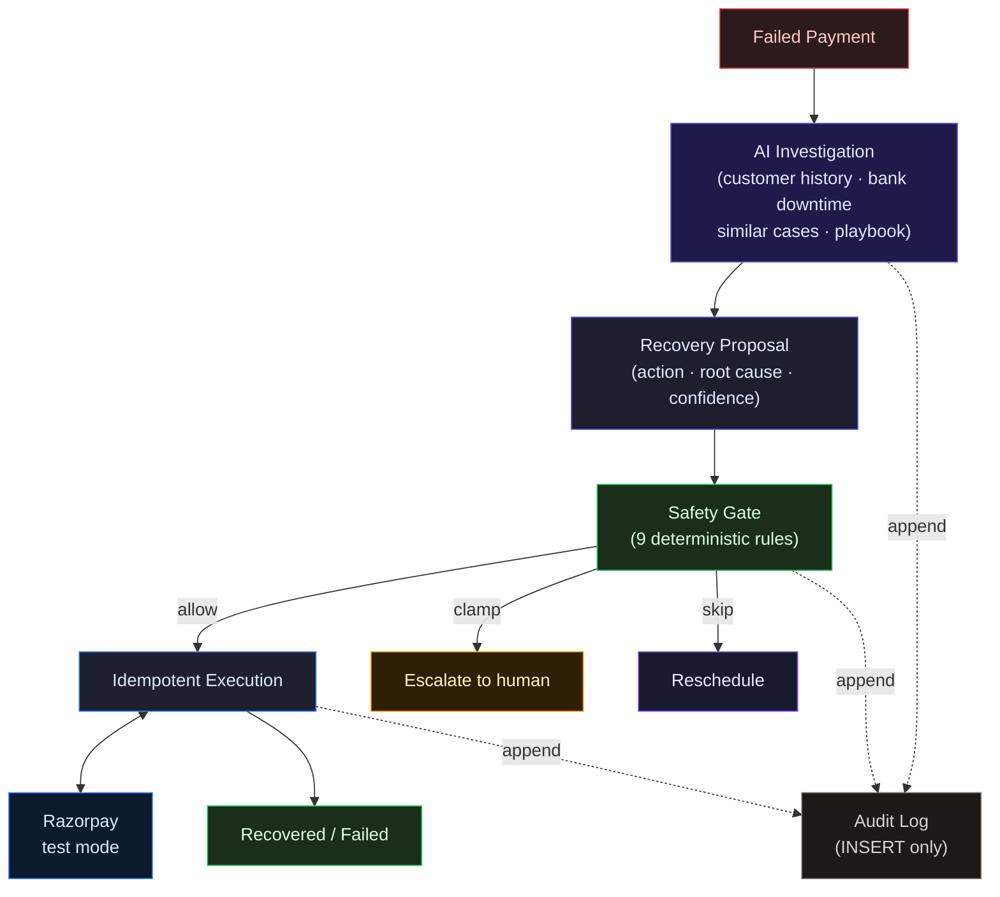

# RecoveryOps

A payment recovery system where AI handles contextual investigation and strategy, while deterministic code retains financial authority.

Built for **Razorpay AI Buildathon 2026 - Track 3 (AI Revenue Recovery)**.


---

## What it does

RecoveryOps processes failed payments through a three-stage pipeline:

**1. Investigation (AI)**

A bounded agent investigates each case using four tools:
- Customer payment history (success rate, cadence, prior attempts)
- Live Razorpay downtime feed (issuer-specific bank outages)
- Similar resolved cases (what recovery actions worked for this failure reason)
- Recovery playbook (mechanism-level guidance, no timing hints)

The agent proposes one recovery action with a root-cause diagnosis and confidence score. The loop is bounded by a step budget (8), a wall-clock deadline (60s), and a forced conclusion on the last step. On timeout or error, it degrades to a safe 48-hour retry.

**2. Safety gate (deterministic)**

Every proposal passes through a pure function that enforces nine rules:

| Rule | Enforces | Human override |
|------|----------|---------------|
| Risk hold | `payment_risk_check_failed` → escalate | Yes |
| Hard decline | Never auto-retry card-issuer permanent declines | No |
| Attempt cap | Maximum 4 attempts per case | No |
| Exposure cap | ₹5,000 per case | Yes |
| Confidence floor | Agent must meet 0.6 confidence to move money | No |
| Charge cooldown | 6 hours between attempts that move money | No |
| Contact cooldown | 24 hours between customer nudges | No |
| Contact window | Customer contact only 08:00-19:00 IST (RBI Fair Practices) | No |
| Write-off diagnosis | Can't write off without an unrecoverable root cause | No |

The gate reads risk holds and hard declines directly from the case's `failureReason`, independent of what the agent diagnosed. It can clamp (retry → escalate), skip (cooldown violation), or allow. It cannot make a proposal less cautious.

**3. Idempotent execution**

One attempt = one `idempotency_key` = at most one Razorpay order/link. The key is unique at the DB level. The attempt row is inserted before any Razorpay call, so a crash mid-flight leaves a durable claim.

On a 5xx or timeout, the system does not assume success or failure. It re-checks `GET /payments/:id` before concluding. Ambiguous attempts land in `AWAITING_RECONCILIATION` and are settled by webhook or reconciliation sweep.

Every proposal, gate decision, Razorpay call, and outcome is recorded in `recovery_events`. The application DB role has `SELECT, INSERT` permissions only. No `UPDATE`, no `DELETE`. Enforced at the Postgres GRANT level.

**Core principle: AI proposes. Deterministic code decides what is allowed.**

---

## Example: Bank downtime override

The agent's value shows when context overrides historical patterns:

```
card_declined
     ↓
customer history: 4 successful payments, monthly payer
     ↓
similar resolved cases: payment link worked 4/5 times
     ↓
bank downtime tool: Bank of India, active high-severity outage
     ↓
agent conclusion: payment link would fail if issuing bank is down
     ↓
proposed action: retry after downtime window instead of following the 4/5 pattern
```

**Same failure code. Different context. Different action.**

The demo GIF below shows this case being worked in real-time:


---

## Architecture



### Layering

```
api / worker / bench → agent · safety · execution · persistence → domain
```

- `domain/` imports nothing from other `src/` folders. Pure functions and types only.
- `agent/`, `safety/`, `execution/`, `persistence/` depend on `domain/` and on interfaces, never on `pg`, Razorpay SDK, or BullMQ types leaking upward.
- `worker/`, `api/`, `bench/` orchestrate. They hold no business rules.
- HTTP DTOs, DB rows, Razorpay responses, and domain objects are distinct types. Convert explicitly at the boundary (Zod).

[`tests/architecture.test.ts`](./tests/architecture.test.ts) walks every import and asserts no layer violations.

---

## Evaluation

60 synthetic cases, same gate and executor, three different strategies:

| Strategy            | Recovered | Recovery Rate |  ₹ Recovered | Root-Cause Accuracy |
|---------------------|----------:|--------------:|-------------:|--------------------:|
| Fixed schedule      |    20 /60 |         33.3% |      ₹31,480 |   - (no diagnosis)  |
| AI agent            |    33 /60 |         55.0% |      ₹51,967 |              73.3%  |
| Deterministic rules |    36 /60 |         60.0% |      ₹56,464 |   - (no diagnosis)  |

### Result

**The rules baseline wins.** A 6-line switch on `error_reason` ([`bench/rules-arm.ts`](./bench/rules-arm.ts)) recovered more revenue than the agent on this corpus.

The agent reached 73.3% root-cause diagnosis accuracy, graded separately so one metric cannot hide the other. The rules table cannot diagnose at all - it has no concept of *why* a payment failed.

The evaluation was designed to measure where AI judgment adds value, not to make AI look good.

**These are test-mode simulations, not real merchant revenue.** The benchmark uses Razorpay's own `error_reason` values and synthetic ground truth for recoverability.

See [`bench/`](./bench/) for the full evaluation code.

---

## What broke

### Risk-hold wiring bug

The safety gate had a risk-hold veto reading `proposal.diagnosisRootCause === "risk_hold"` plus an optional `riskHoldForCase` callback. The callback was optional and wasn't passed at any construction site.

**Impact**: A misdiagnosed risk-flagged payment would have bypassed the one rule that exists to force a human decision.

**Fix**: The gate now reads `isRiskHold(kase)` directly from the case's `failureReason`, independent of what the agent concluded.

**Proof**: [`tests/pipeline.integration.test.ts`](./tests/pipeline.integration.test.ts) drives a risk-flagged payment through a deliberately wrong model, asserts the gate escalates it, and verifies **zero calls to Razorpay**:

```bash
npm test -- pipeline.integration.test.ts -t "escalates a risk-hold case"
```

### Benchmark leakage

The benchmark wrote failure detail onto attempt rows with strings like `"too early, recovers at +72h"`. The agent reads prior attempts as a tool. On its second turn, it was reading the answer key.

**Fix**: Every failed outcome now returns a flat `"payment declined"` string. A test enforces this and fails if any recovery hint reaches the agent.

**Cost**: The honest number after the fix was 45% agent vs 47% fixed - the agent was briefly losing. The old headline was retired.

**Outcome**: The corpus was hardened, the prompt de-spoonfed, the agent re-recorded on a better model. Final result: 55% agent vs 60% rules. The rules table still wins, and that's the published number.

See [`BREAKS.md`](./BREAKS.md) for 13 other failures, including:
- The escalation rail that used to be a dead end
- The dedupe that could permanently drop a real capture
- The schema apply script that silently ran a truncated file
- The cache that silently replayed stale recordings

---

## Reliability

### Ambiguous Razorpay responses

A 5xx or timeout mid-create does not tell us whether the order/link was created. Razorpay's order list is eventually consistent (lag on the order of minutes).

**Fix**: The attempt row's own `UNIQUE idempotency_key` is authoritative. Ambiguous creates land in `AWAITING_RECONCILIATION`. The executor re-checks `GET /payments/:id` before concluding.

**Principle**: Never assume an ambiguous payment attempt succeeded or failed without reconciliation.

### Idempotent execution

One attempt = one `idempotency_key` = at most one Razorpay order/link. The key is unique at the DB level. The attempt row is inserted *before* any Razorpay call, so a crash mid-flight leaves a durable claim, never a lost or doubled attempt.

### Webhook deduplication

Duplicate Razorpay webhooks (same event ID) are deduplicated. If the process died between recording the event ID and settling the attempt, a redelivery settles it instead of being treated as a no-op.

### Append-only event log

Every proposal, gate decision, Razorpay call, and outcome is recorded in `recovery_events`. The application database role has `SELECT, INSERT` permissions only. No `UPDATE`, no `DELETE`. Enforced at the Postgres GRANT level, not by convention.

See [`db/schema.sql`](./db/schema.sql) line 88.

An integration test connects as `recovery_app`, tries to UPDATE the event log, and expects the database to refuse.

---

## Tech stack

| Layer | Technology | Why |
|-------|-----------|-----|
| Runtime | Node 20+ / TypeScript (ESM) | Type safety at boundaries, ESM for clean imports |
| API | Fastify | HTTP API and schema validation |
| Database | PostgreSQL 16 | ACID transactions, row-level locks for concurrency, role-based grants for append-only |
| Queue | Redis + BullMQ | Durable job queue, supports priorities and delays |
| Agent | Vercel AI SDK v7 + hand-rolled loop | Tool-use standardized, streaming built-in. Loop is owned code (step budget, deadline, degrade-to-safe) |
| LLM | OpenRouter + Google Gemini | No minimum spend, no cloud billing. Model is env-configurable |
| Validation | Zod | Runtime schema validation at every external boundary |
| Gateway | Razorpay test mode | Real Orders, Payment Links, Checkout, webhook signatures |
| Frontend | React + Vite | Fast dev loop, streaming hooks |
| Container | Docker Compose | Single-command dev environment |
| Testing | Vitest | Fast, native ESM support, 223 tests |

No agent framework (the bounds are the product, not framework config). No ORM (would cost the DB-grant proof). No DI container.

---

## Repository map

```
src/
├── agent/          # Bounded tool loop, prompt, tools
├── safety/         # Deterministic safety gate (pure function)
├── execution/      # Razorpay client, attempt executor, webhook handler
├── persistence/    # Postgres repositories, event log
├── worker/         # BullMQ pipeline: case → agent → gate → executor → record
├── domain/         # Pure types and business rules, zero I/O
└── api/            # Fastify routes, SSE streams

bench/              # Three-arm evaluation (agent, fixed, rules)
web/                # React UI: case flow, agent reasoning stream, scoreboard
db/                 # Schema, role grants
tests/              # 223 tests, including safety-gate property tests
```

---

## Run locally

```bash
git clone https://github.com/Mithurn/RecoveryOps.git
cd RecoveryOps

# 1. Environment
cp .env.example .env
# Fill in:
#   OPENROUTER_API_KEY (or GOOGLE_GENERATIVE_AI_API_KEY)
#   RAZORPAY_KEY_ID, RAZORPAY_KEY_SECRET (test mode)
#   RAZORPAY_WEBHOOK_SECRET

# 2. Infrastructure
docker compose up -d    # Postgres :5434, Redis :6381

# 3. Install
npm install

# 4. Database + seed
npm run db:schema       # Apply schema
npm run seed:room       # Seed from recorded benchmark

# 5. Run
npm run dev             # API :3000, Web :5173

# 6. Tests
npm test                # All 223 tests

# 7. Specific safety regression tests
npm test -- pipeline.integration.test.ts -t "escalates a risk-hold case"
npm test -- safety-gate.test.ts -t "risk hold"
```

### Evaluation

```bash
# Replay the recorded benchmark (free, ~1s)
AGENT_MODEL=google/gemini-3.6-flash npm run bench -- --size 60 --mock

# Run a fresh agent evaluation ($1.20-1.35, ~5min)
AGENT_MODEL=google/gemini-3.6-flash npm run bench -- --size 60 --cap-usd 3.00

# Rules baseline only (no model, free)
npm run bench -- --arm rules --size 60 --mock
```

---

## Limitations

- **Razorpay test mode.** No real merchant traffic. Incoming failures are synthetic.
- **60-case benchmark.** Small corpus, templated. Rules baseline wins because the template's `failureReason` is the answer key.
- **One merchant, one currency.** No multi-tenancy.
- **Card-focused.** No UPI/netbanking origination, no subscriptions or mandates.
- **Human intervention required.** Escalated cases need manual resolution.
- **`CUSTOMER_NUDGE` is a labeled stub.** No email/SMS/WhatsApp provider is wired.
- **Not production-ready.** This is a bounded evaluation system, not a production payment recovery platform.

---

## Conclusion

RecoveryOps demonstrates where AI judgment adds value in payment recovery: diagnosing root causes and adapting strategy to context. The agent reached 73% root-cause accuracy on a synthetic benchmark. A simpler rules table recovered more revenue.

The separation of concerns remains:

> **AI owns recovery strategy.**
>
> **Deterministic code owns authority.**

**Built for Razorpay AI Buildathon 2026** by [Mithurn](https://github.com/Mithurn).
