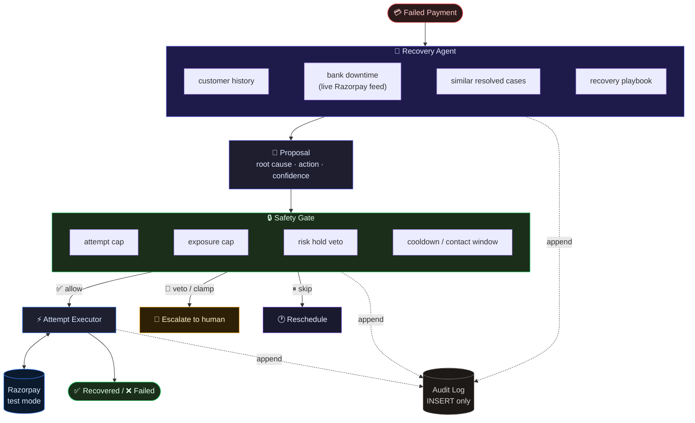

# RecoveryOps

AI-assisted recovery for failed payments, with deterministic controls around every action.

Built for **Razorpay AI Buildathon 2026 - Track 3 (AI Revenue Recovery)**.


> **Add GIF here:** `` once you create it

---

## What it does

A failed payment enters RecoveryOps as a case. A bounded AI agent investigates the context: pulls the customer's payment history, checks whether the issuing bank is in a live Razorpay downtime window, looks at what worked for similar cases, and checks this case's own prior attempts.

The agent proposes one recovery move: retry now, retry later, send a payment link on a different rail, nudge the customer to update their method, escalate to a human, or write it off.

A deterministic safety gate validates the proposal. It can only make it more cautious, never less. It enforces an attempt cap, a rupee exposure limit, cooldowns, the RBI Fair Practices contact window (08:00-19:00 IST), and a mandatory escalation on risk-flagged payments. The gate reads the risk flag directly from the case data, not from the agent's diagnosis.

If the proposal passes, execution happens through Razorpay test mode exactly once (one idempotency key per attempt). On an ambiguous response (5xx / timeout), it re-checks before concluding. Every proposal, gate decision, and outcome is recorded in an append-only audit trail.

**Core principle: AI proposes. Deterministic code decides what is allowed.**

---

## The hero case

The strongest contextual decision in the demo:

```
card_declined
     ↓
customer history: 4 successful payments, monthly payer
     ↓
Bank of India downtime: active, high severity
     ↓
similar resolved cases: payment link worked 4/5 times
     ↓
historical pattern says "send link"
     ↓
agent sees current bank outage
     ↓
proposes 24h retry instead
```

**Same failure code. Different context. Different action.**

The agent overrides the historical pattern because a payment link would fail if the issuing bank is down.

---

## Safety boundary

```
Failed Payment
      ↓
AI Investigation
 (customer history, bank downtime, similar cases, playbook)
      ↓
Recovery Proposal
      ↓
Deterministic Safety Gate
   ├─ Allow (proposal passes all rules)
   ├─ Clamp (retry → escalate due to risk hold / exposure cap)
   ├─ Skip (cooldown / contact window violation)
   └─ Reschedule (attempted too soon, wait N hours)
      ↓
Execution (one idempotency key, re-check on 5xx)
      ↓
Razorpay Test Mode
      ↓
Outcome + Append-Only Audit Ledger
```

### Safety invariants

The gate enforces nine rules:

1. **Risk hold**: Any `payment_risk_check_failed` must escalate to a human. Read from the case, not from the agent's diagnosis.
2. **Hard decline veto**: Never auto-retry a decline that won't clear on its own (Visa/Mastercard fine merchants for this).
3. **Attempt cap**: Maximum 4 attempts per case.
4. **Exposure cap**: ₹5,000 per case. Over-limit cases escalate.
5. **Confidence floor**: Agent must meet minimum confidence threshold.
6. **Charge cooldown**: 6 hours between attempts that move money.
7. **Contact cooldown**: Separate cooldown for customer nudges.
8. **RBI contact window**: Customer contact only 08:00-19:00 IST.
9. **Write-off needs diagnosis**: Can't write off without an unrecoverable root cause.

A recorded human authorization can satisfy exactly two rules (risk hold and exposure cap), never the ones with regulatory weight (hard decline, attempt cap) or either cooldown.

**The model can propose an action. It cannot bypass deterministic controls.**

---

## Evaluation

60 synthetic cases, same gate and executor, three different strategies:

| Strategy            | Recovered | Recovery Rate |  ₹ Recovered | Root-Cause Accuracy |
|---------------------|----------:|--------------:|-------------:|--------------------:|
| Fixed schedule      |    20 /60 |         33.3% |      ₹31,480 |   - (no diagnosis)  |
| AI agent            |    33 /60 |         55.0% |      ₹51,967 |              73.3%  |
| Deterministic rules |    36 /60 |         60.0% |      ₹56,464 |   - (no diagnosis)  |

### Result

**The rules baseline wins.** A 6-line switch on `error_reason` (`bench/rules-arm.ts`) recovered more than the agent on this corpus.

The agent was not claimed to outperform the simpler baseline. The evaluation was designed to measure where AI judgment adds value, not to make AI look good.

### Root-cause accuracy

**73.3%** on seed 42. Graded separately from recovery outcome so one metric cannot hide the other. A null diagnosis (loop degrades before concluding) counts as wrong, not excluded.

The rules table cannot diagnose at all. It has no concept of *why* a payment failed.

**These are test-mode simulations, not real merchant revenue.** The benchmark uses Razorpay's own `error_reason` values and synthetic ground truth for recoverability.

See [`bench/`](./bench/) for the full evaluation code.

---

## What broke

### Risk-hold wiring bug

The safety gate had a risk-hold veto. It looked correct in the code.

**Actual bug**: The veto read `proposal.diagnosisRootCause === "risk_hold"` plus an optional `riskHoldForCase` callback. The callback was optional. It wasn't passed at any construction site.

**Impact**: A payment the agent misdiagnosed as `soft_decline` would have sailed straight through to auto-retry, bypassing the one rule that exists specifically to force a human decision.

**Fix**: The gate now reads `isRiskHold(kase)` directly from the case's own `failureReason` field, independent of what the agent concludes.

**Safeguard**: [`tests/pipeline.integration.test.ts`](./tests/pipeline.integration.test.ts) drives a risk-flagged payment through a deliberately wrong model, asserts the gate escalates it, and verifies **zero calls to Razorpay**.

This is the regression test that protects against this exact failure:

```bash
npm test -- pipeline.integration.test.ts -t "escalates a risk-hold case"
```

### Benchmark leakage

**Expected**: The agent beats the fixed schedule because it diagnoses better.

**Actual**: The benchmark wrote failure detail onto attempt rows with strings like `"too early, recovers at +72h"`. The agent reads prior attempts as a tool. On its second turn, it was reading the answer key.

**Fix**: Every failed outcome now returns a flat `"payment declined"` string. A test enforces this and fails if any recovery hint reaches the agent.

**Cost**: The honest number after the fix was 45% agent vs 47% fixed. The agent was briefly *losing*. The old headline was retired.

**Outcome**: The corpus was hardened, the prompt was de-spoonfed, the agent was re-recorded on a better model. Final result: 55% agent vs 60% rules. The rules table still wins, and that's the published number.

See [`BREAKS.md`](./BREAKS.md) for the full failure log, including:
- The escalation rail that used to be a dead end
- The guardrail that was quietly disarmed by its own bug
- The schema apply script that silently ran a truncated file
- The cache that silently replayed stale recordings

---

## Reliability

### Ambiguous Razorpay responses

A 5xx or timeout does not tell us whether the external write happened. Razorpay's order list is eventually consistent (lag on the order of minutes). A missing result could cause an unsafe retry.

**Fix**: The attempt row's own `UNIQUE idempotency_key` is authoritative, not Razorpay's list. Ambiguous creates land in `AWAITING_RECONCILIATION`. On any uncertain gateway outcome, the executor re-checks `GET /payments/:id` before concluding.

**Principle**: Never assume an ambiguous payment attempt succeeded or failed without reconciliation.

### Exactly-once execution

One attempt = one `idempotency_key` = at most one Razorpay order/link. The key is unique at the DB level. The attempt row is inserted *before* any Razorpay call, so a crash mid-flight leaves a durable claim, never a lost or doubled attempt.

### Webhook deduplication

Duplicate Razorpay webhooks (same event ID) are deduplicated. If the process died between recording the event ID and settling the attempt, a redelivery settles it instead of being treated as a no-op.

### Append-only event log

Every proposal, gate decision, Razorpay call, and outcome is recorded in `recovery_events`. The application database role has `SELECT, INSERT` permissions only. No `UPDATE`, no `DELETE`. Enforced at the Postgres GRANT level, not by convention.

See [`db/schema.sql`](./db/schema.sql) line 88.

An integration test connects as `recovery_app`, tries to UPDATE the event log, and expects the database to refuse.

---

## Architecture



### Layering

```
api / worker / bench → agent · safety · execution · persistence → domain
```

- `domain/` imports nothing from other `src/` folders. Pure functions and types only.
- `agent/`, `safety/`, `execution/`, `persistence/` depend on `domain/` and on interfaces, never on `pg`, Razorpay SDK, or BullMQ types leaking upward.
- `worker/`, `api/`, `bench/` orchestrate. They hold no business rules.
- HTTP DTOs, DB rows, Razorpay responses, and domain objects are distinct types. Convert explicitly at the boundary (Zod).

[`tests/architecture.test.ts`](./tests/architecture.test.ts) walks every import and asserts no layer violations.

---

## Tech stack

| Layer | Technology | Why |
|-------|-----------|-----|
| Runtime | Node 20+ / TypeScript (ESM) | Type safety at boundaries, ESM for clean imports |
| API | Fastify | Fastest Node HTTP server, schema validation built-in |
| Database | PostgreSQL 16 | ACID transactions, row-level locks for concurrency, role-based grants for append-only |
| Queue | Redis + BullMQ | Durable job queue, supports priorities and delays |
| Agent | Vercel AI SDK v7 + hand-rolled loop | Tool-use standardized, streaming built-in. Loop is owned code (step budget, deadline, degrade-to-safe) |
| LLM | OpenRouter + Google Gemini | No minimum spend, no cloud billing. Model is env-configurable |
| Validation | Zod | Runtime schema validation at every external boundary |
| Gateway | Razorpay test mode | Real Orders, Payment Links, Checkout, webhook signatures |
| Frontend | React + Vite | Fast dev loop, streaming hooks |
| Container | Docker Compose | Single-command dev environment |
| Testing | Vitest | Fast, native ESM support, 223 tests |

**12 runtime dependencies, deliberately.** No agent framework (the bounds are the product, not framework config). No ORM (would cost the DB-grant proof). No DI container (`src/main.ts` is 130 lines). Each dependency earns its place.

---

## Repository map

```
src/
├── agent/          # Bounded tool loop, prompt, tools
├── safety/         # Deterministic safety gate (pure function)
├── execution/      # Razorpay client, attempt executor, webhook handler
├── persistence/    # Postgres repositories, event log
├── worker/         # BullMQ pipeline: case → agent → gate → executor → record
├── domain/         # Pure types and business rules, zero I/O
└── api/            # Fastify routes, SSE streams

bench/              # Three-arm evaluation (agent, fixed, rules)
web/                # React UI: case flow, agent reasoning stream, scoreboard
db/                 # Schema, role grants
tests/              # 223 tests, including safety-gate property tests
```

---

## Run locally

```bash
git clone https://github.com/Mithurn/RecoveryOps.git
cd RecoveryOps

# 1. Environment
cp .env.example .env
# Fill in:
#   OPENROUTER_API_KEY (or GOOGLE_GENERATIVE_AI_API_KEY)
#   RAZORPAY_KEY_ID, RAZORPAY_KEY_SECRET (test mode)
#   RAZORPAY_WEBHOOK_SECRET

# 2. Infrastructure
docker compose up -d    # Postgres :5434, Redis :6381

# 3. Install
npm install

# 4. Database + seed
npm run db:schema       # Apply schema
npm run seed:room       # Seed from recorded benchmark

# 5. Run
npm run dev             # API :3000, Web :5173

# 6. Tests
npm test                # All 223 tests

# 7. Specific safety regression tests
npm test -- pipeline.integration.test.ts -t "escalates a risk-hold case"
npm test -- safety-gate.test.ts -t "risk hold"
```

### Evaluation

```bash
# Replay the recorded benchmark (free, ~1s)
AGENT_MODEL=google/gemini-3.6-flash npm run bench -- --size 60 --mock

# Run a fresh agent evaluation ($1.20-1.35, ~5min)
AGENT_MODEL=google/gemini-3.6-flash npm run bench -- --size 60 --cap-usd 3.00

# Rules baseline only (no model, free)
npm run bench -- --arm rules --size 60 --mock
```

---

## Limitations

- **Razorpay test mode.** No real merchant traffic. Incoming failures are synthetic.
- **60-case benchmark.** Small corpus, templated. Rules baseline wins because the template's `failureReason` is the answer key.
- **One merchant, one currency.** No multi-tenancy.
- **Card-focused.** No UPI/netbanking origination, no subscriptions or mandates.
- **Human intervention required.** Escalated cases need manual resolution.
- **`CUSTOMER_NUDGE` is a labeled stub.** No email/SMS/WhatsApp provider is wired.
- **Not production-ready.** This is a bounded evaluation system, not a production payment recovery platform.

---

## Conclusion

The goal was not to prove that AI always beats rules.

It was to find where AI judgment actually adds value in payment recovery, while keeping financial authority deterministic and bounded.

**What we found**: One specific moment where context overrides the historical pattern. The agent reaches 73% root-cause diagnosis accuracy, a capability the rules table cannot produce. On recovery rate, the rules table wins.

**The principle remains**:

> **AI owns recovery strategy.**
>
> **Deterministic code owns authority.**

---

## Links

- [BREAKS.md](./BREAKS.md) - Full failure log
- [RUN.md](./RUN.md) - Detailed setup guide
- [Benchmark code](./bench/) - Three-arm evaluation
- [Safety gate](./src/safety/safety-gate.ts) - Nine rules, property-tested
- [Risk-hold regression test](./tests/pipeline.integration.test.ts) - Zero Razorpay calls

**Built for Razorpay AI Buildathon 2026** by [Mithurn](https://github.com/Mithurn).
