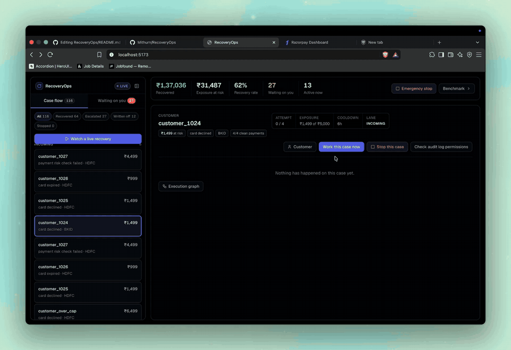
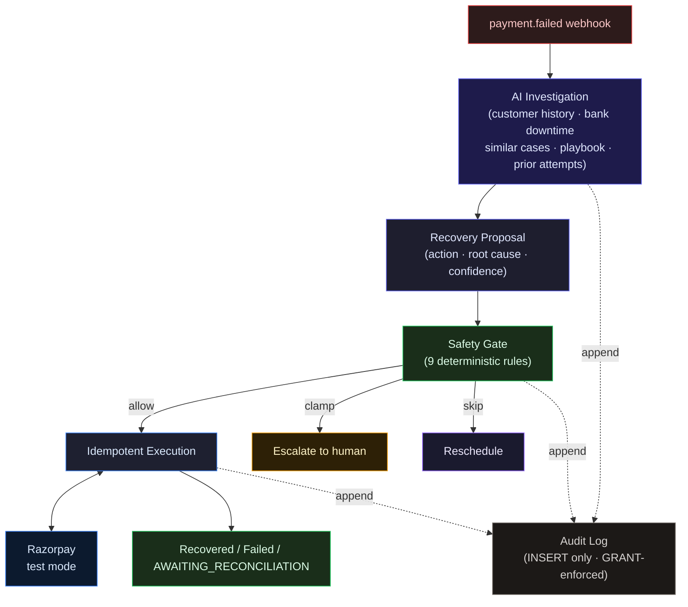

# RecoveryOps

**A decision-making and execution system for ambiguous payment failures.**

Built for Razorpay AI Buildathon 2026 — Track 3: AI Revenue Recovery.


[](https://www.tella.tv/video/fixing-failed-payments-with-recovery-ops-ddbz)

▶ [Watch the demo on Tella](https://www.tella.tv/video/fixing-failed-payments-with-recovery-ops-ddbz)

---

## The problem

A payment gateway can detect that a charge failed. It cannot tell you whether it's a transient bank timeout (retry in 24 h), a card that will never fund again (write off), or a risk hold a human must approve (escalate) — Razorpay hands back the same `error_reason` for all three. Standard dunning logic skips investigation and retries on a fixed schedule, racking up decline fees and missing cases that need a different action.

RecoveryOps answers one question per failed payment: **what is the right recovery action for this specific case, and is it safe to execute?**

**The agent can change its mind. The safety layer cannot.**



---

## Evaluation

A single 60-case batch, same gate and executor, three strategies. The last column reruns each arm with Razorpay's `error_reason` label blanked out. All figures measured on `google/gemini-3.6-flash`; the repo default is a free model for local development — see [`RUN.md`](./RUN.md#model-selection).

| Strategy | Recovered | Recovery Rate | ₹ Recovered | Root-Cause Accuracy | Rate, label hidden |
|----------|----------:|--------------:|------------:|--------------------:|-------------------:|
| Fixed schedule | 20/60 | 33.3% | ₹31,480 | — (no diagnosis) | 33.3% |
| AI agent | 34/60 | 56.7% | ₹53,966 | 73.3% | **38.3%** |
| Deterministic rules | 36/60 | 60.0% | ₹56,464 | — (no diagnosis) | **33.3%** |

> Numbers were re-measured after a post-submission bug fix (survivorship bias in `get_similar_resolved_cases`). The pitch video uses the pre-fix numbers. Before/after comparison and full context in [`BREAKS.md`](./BREAKS.md).

### What the result means

**The rules table wins on raw recovery** — and that result stands. It wins because [`bench/rules-arm.ts`](./bench/rules-arm.ts) is the agent's own system-prompt playbook transcribed into a 6-case switch: same 7 answers, no reasoning required. On a fully-enumerated corpus, a lookup table built from the same answer key wins by construction.

**Hide the label, and the agent leads.** `--blind-reason` removes `error_reason` before any arm sees it. The rules table collapses to a fixed schedule (33.3%). The agent holds 38.3% — still ahead, using tool-driven reasoning instead of label-reading.

**73.3% root-cause accuracy vs zero for both baselines.** That is the metric neither baseline can produce: not what to do, but why the payment failed. The bank-downtime case in the demo is the clearest example — history says "send a payment link," the agent says "no, the issuing bank is down, retry in 4 hours."

### Cross-seed consistency

Across seeds 42, 7, 13, 99, and 2024 the agent recovers **51.7–61.7%** against the rules table's **55.0–63.3%**. The rules table's win is consistent:

| Seed | Agent | Rules |
|------|------:|------:|
| 42 | 56.7% | 60.0% |
| 7 | 51.7% | 58.3% |
| 13 | 61.7% | 63.3% |
| 99 | 56.7% | 60.0% |
| 2024 | 53.3% | 55.0% |

`--blind-reason` control, seed 42:

| | agent | fixed | rules |
|--|------:|------:|------:|
| Recovery rate | 38.3% | 33.3% | 33.3% |
| ₹ recovered | ₹37,477 | ₹31,480 | ₹31,480 |
| Root-cause accuracy | 30.0% | — | — |

```bash
AGENT_MODEL=google/gemini-3.6-flash npm run bench -- --size 60 --seed 42 --mock --blind-reason
```

### What the agent missed

Of the 26 unrecovered cases on seed 42:

- **16 are correct stops.** 8 risk holds (must go to a human by policy) and 8 genuinely unfunded accounts — 7 escalate after exhausting the attempt cap, 1 is correctly written off. These are the intended outcomes.
- **10 are real misses.** Bank-downtime and generic-decline cases where a retry or nudge timed past the window before it cleared.

The largest systematic error: all 8 unfunded cases are diagnosed `insufficient_funds` until nearly the last attempt. The only separating signal (a rising failure trend in customer history) isn't weighted heavily enough to flip the diagnosis before the attempt cap forces a stop. Every miss has its full tool-call trace in [`bench/.cache/`](./bench/.cache/).

### Cost

Full 60-case seed-42 run, measured from the provider's own usage blocks:

| | measured |
|---|---:|
| Model calls | 486 |
| Input / output tokens | 1,125,913 / 176,461 |
| Cost @ $1.50 / $7.50 per M | **$3.0123** |
| Cost per recovery | **$0.0886** |
| ₹ recovered per $1 of model spend | **₹17,915** |

`--mock` replays this run at zero model calls.

---

## How it works

1. **Webhook arrives.** HMAC-verified. Written into a deduplicated inbox. A new case is queued.

2. **Agent investigates.** Up to 6 tool calls, 90-second deadline. Calls customer history, bank downtime, similar resolved cases, the playbook, and prior attempts — then proposes one action with a root cause and confidence score. On timeout or malformed output it degrades to a 48 h retry with `null` root cause, never a guessed one.

3. **Safety gate runs.** Nine deterministic rules (risk hold, hard decline, attempt cap, exposure cap, confidence floor, charge cooldown, contact cooldown, RBI contact window, write-off diagnosis check). The gate can clamp or skip but **cannot make a proposal less cautious**. Same inputs always produce same output.

4. **Executor claims the attempt** (via `UNIQUE idempotency_key`) before touching Razorpay. A 5xx or timeout lands in `AWAITING_RECONCILIATION` — the executor re-checks the specific artifact it created, never concludes from list absence.

5. **Everything is appended** to `recovery_events`. The application DB role has `SELECT, INSERT` only — no `UPDATE`, no `DELETE`. Enforced at the Postgres `GRANT` level.

---

## Safety guarantees — stopping rules and compliant escalation

| Rule | Enforces | Overridable by human |
|------|----------|---------------------|
| Risk hold | `payment_risk_check_failed` always escalates | Yes |
| Hard decline | Card-network permanent declines never auto-retry | No |
| Attempt cap | Maximum 4 attempts per case | No |
| Exposure cap | ₹5,000 per case before human sign-off | Yes |
| Confidence floor | Agent must meet 0.6 confidence to move money | Not by the agent — see note |
| Charge cooldown | 6 hours between money-moving attempts | No |
| Contact cooldown | 24 hours between customer-facing actions | No |
| Contact window | 08:00–19:00 IST only (RBI Fair Practices Code) | No |
| Write-off gate | Cannot write off without an unrecoverable root cause | No |

The gate is a pure function — no I/O, no state. The test suite ([`tests/safety-gate.test.ts`](./tests/safety-gate.test.ts)) runs property checks across 4,608 input combinations. The risk-hold check reads `failureReason` directly from the case, independent of the agent's diagnosis — a misdiagnosed case cannot bypass human review. One weakness is documented: the write-off gate relies on the agent's own `diagnosisRootCause`, which has no independent case-level backstop the way risk-hold does. Flagged in [`BREAKS.md`](./BREAKS.md).

---

## Razorpay integration

RecoveryOps uses Razorpay's test mode throughout: real API calls, real HMAC webhook verification, real order and payment-link creation, real capture events.

Three behaviours discovered empirically and documented in [`BREAKS.md`](./BREAKS.md):

- `receipt` is **not** a uniqueness key at Razorpay. `reference_id` is, but only on payment links.
- Order list responses are eventually consistent — a 5xx mid-create cannot be resolved by checking the list.
- Throttling returns `400`, not `429`.

---

## What broke

15 failures in [`BREAKS.md`](./BREAKS.md), written as they were found. Three worth naming here:

**Risk-hold veto was wired to the wrong signal.** The gate originally read `proposal.diagnosisRootCause === "risk_hold"` — a misdiagnosed case could bypass human review. Fix: gate now reads `failureReason` from the case directly.

```bash
npm test -- pipeline.integration.test.ts -t "escalates a risk-hold case"
```

**Benchmark leaked the answer key.** Failed attempt rows contained strings like `"too early, recovers at +72h"`. The agent read them as tool input. Fix: failed outcomes return `"payment declined"`. The honest number dropped. It was republished.

**Survivorship bias in the agent's own evidence tool.** `get_similar_resolved_cases` filtered to `lane = 'RECOVERED'` only — the agent never saw escalated or written-off cases. Fix: query now matches any terminal lane. The number moved up, not down.

---

## What we chose not to build, and why

- **Outbound messaging is not dispatched.** The agent decides `CUSTOMER_NUDGE` or `PAYMENT_LINK`; the execution layer records the decision and the contact-attempt count. Composing and sending an actual message has no verifiable success criterion on a synthetic corpus. The domain type and every safety rule that gates a real send are in place; wiring a provider is integration work, not a decision problem.
- **Synthetic corpus, by design.** 60 cases from 7 templates. Two share the same `error_reason` with opposite ground truth — the only separating signal is a rising failure trend in customer history. The rules baseline wins on raw recovery anyway; see [Evaluation](#evaluation).
- **Card payments only.** UPI and netbanking origination work; mandate/subscription recovery follows a different regulatory retry cadence and is not modelled here.
- **Single-tenant.** One `MERCHANT_REF` per deployment.
- **Concurrency is tested; throughput is not.** Executor and webhook races have integration tests proving correctness. High-volume load testing has not been done.

---

## Tech stack

| Layer | Technology | Why |
|-------|-----------|-----|
| Runtime | Node 22 / TypeScript (ESM) | Type safety at every boundary |
| API | Fastify | HTTP, schema validation, SSE |
| Database | PostgreSQL 16 | ACID, row-level locks, role-based grants |
| Queue | Redis + BullMQ | Durable jobs, delay scheduling |
| Agent | Vercel AI SDK v7 + hand-rolled bounded loop | SDK handles tool-call transport; step budget, deadline, and degrade path are owned code |
| LLM | OpenRouter / Google Gemini | Env-configurable; no vendor lock-in |
| Validation | Zod | Runtime schema at every external boundary |
| Gateway | Razorpay test mode | Real API calls, real HMAC |
| Frontend | React + Vite | Streaming hooks, fast dev loop |
| Container | Docker Compose | Single-command environment |
| Testing | Vitest | 245 tests, ESM-native |

No agent framework for the decision loop — the step budget, wall-clock deadline, forced conclusion, and degrade-to-safe path are owned code, not framework config, because those bounds are what's being measured. No ORM — the append-only guarantee requires raw SQL grants. No DI container — dependencies are constructed once at `src/main.ts`.

### What changes in production

| What | Demo | Production |
|------|------|-----------|
| Razorpay | Test mode keys | Live keys — same API surface |
| Database | Docker Compose Postgres | Managed Postgres — schema and grants identical |
| Queue | Docker Compose Redis | Managed Redis (Upstash, ElastiCache) |
| Agent (Vercel AI SDK) | OpenRouter / Google Gemini — model is env-configurable | Swap to production API keys; model ID is a single env var |
| Auth | Soft gate: bearer token enforced when `DEMO_ACCESS_TOKEN` is set; open when unset so reviewers run without setup | Per-merchant JWT |
| Outreach | `CUSTOMER_NUDGE` logged, not dispatched | Messaging provider (Twilio, Exotel, MSG91) |

---

## Repository structure

```
src/            Backend — see src/BACKEND.md
bench/          Three-arm evaluation harness (agent · fixed · rules)
web/            React UI — see web/FRONTEND.md
db/             Schema and role grants
tests/          245 tests
scripts/        verify-audit, explain CLIs
BREAKS.md       15 documented failures, written as found
EVIDENCE.md     Every README number mapped to the exact reproducing command
RUN.md          Quickstart and demo walkthrough
```

---

## Quickstart

```bash
git clone https://github.com/Mithurn/RecoveryOps.git
cd RecoveryOps
cp .env.example .env
# fill: OPENROUTER_API_KEY (or GOOGLE_GENERATIVE_AI_API_KEY)
#       RAZORPAY_KEY_ID, RAZORPAY_KEY_SECRET (test mode keys)
#       RAZORPAY_WEBHOOK_SECRET

docker compose up -d          # Postgres :5434, Redis :6381
npm install
npm run db:schema             # apply schema + role grants
npm run seed:room             # seed Recovery Room from recorded bench
npm run dev                   # API :3000, web :5173
npm test                      # 245 tests
```

### Reproduce the evaluation

```bash
# Replay recorded runs — free, ~1s
AGENT_MODEL=google/gemini-3.6-flash npm run bench -- --size 60 --seed 42 --mock

# Blind-reason control
AGENT_MODEL=google/gemini-3.6-flash npm run bench -- --size 60 --seed 42 --mock --blind-reason

# Live run (~$3, ~7 min)
AGENT_MODEL=google/gemini-3.6-flash npm run bench -- --size 60 --seed 1 --cap-usd 5.00
```

---

**Backend:** [`src/BACKEND.md`](./src/BACKEND.md) · **Frontend:** [`web/FRONTEND.md`](./web/FRONTEND.md) · **Failure log:** [`BREAKS.md`](./BREAKS.md) · **Evidence:** [`EVIDENCE.md`](./EVIDENCE.md)
