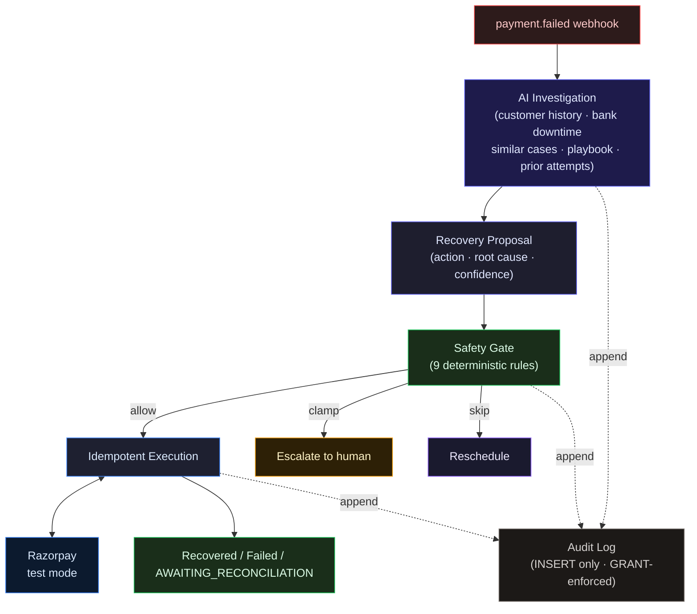

# RecoveryOps

**A decision-making and execution system for ambiguous payment failures.**

Built for Razorpay AI Buildathon 2026 — Track 3: AI Revenue Recovery.


---

## The problem

A payment gateway can detect that a charge failed. It cannot tell you whether the failure is a
transient bank timeout (retry in 24 hours), a customer whose account will never fund (write off),
or a risk hold that a human must approve (escalate). Every one of those cases has the same
`error_reason` field from Razorpay. The right recovery action differs by context, and context
requires investigation.

Standard dunning logic retries on a fixed schedule regardless of cause. That racks up decline
fees, irritates customers whose cards are genuinely broken, and misses customers who would have
paid if reached through the right channel at the right time.

---

## What RecoveryOps does

RecoveryOps answers one question per failed payment: **what is the right recovery action for this specific case, and is it safe to execute?**

The hard problem in payment recovery is not detecting failures — every gateway does that. It is deciding what to do about each one. A bank timeout needs a different action than an expired card, which needs a different action than a risk hold. Standard retry logic applies the same schedule to all three. RecoveryOps runs a bounded investigation per case, proposes the contextually appropriate action, and enforces a deterministic safety contract before any money moves.

```
Failed Payment
      ↓
Bounded Investigation Agent
      ↓                      ← customer history · bank downtime · similar cases · prior attempts
Recovery Proposal
 (action · root cause · confidence)
      ↓
Deterministic Safety Gate
 (9 rules, pure function)
      ↓               ↓               ↓
   Allow           Clamp to        Skip and
   execution       ESCALATE        reschedule
      ↓
Idempotent Razorpay execution
      ↓
Recovered / Failed / AWAITING_RECONCILIATION
      ↓
Reconcile / Audit / Re-plan
```

**The agent can change its mind. The safety layer cannot.**

The agent proposes a strategy. The gate holds financial authority. Every outcome is recorded in an
append-only audit log the application cannot modify.

---

## Recovery lifecycle

1. A `payment.failed` webhook arrives. HMAC-verified. Written into a deduplicated inbox. A new
   case is created and queued.

2. The agent runs a bounded investigation: up to 6 steps, 60-second wall-clock deadline. It calls
   up to five tools and proposes one action with a root cause and confidence score. If the deadline
   or step budget fires, it degrades to a 48-hour retry with a `null` root cause — never a guessed
   one.

3. Every proposal passes through the safety gate. The gate enforces nine deterministic rules (risk
   hold, hard decline, attempt cap, exposure cap, confidence floor, charge cooldown, contact
   cooldown, RBI contact window, write-off diagnosis check). It can clamp (escalate the action),
   skip (defer), or allow. It cannot make a proposal less cautious than what the agent proposed.

4. If allowed, the executor claims the attempt row (with a `UNIQUE idempotency_key`) before
   touching Razorpay. One key = at most one Razorpay order or payment link. A 5xx or timeout lands
   the attempt in `AWAITING_RECONCILIATION` — the executor re-checks `GET /orders/:id/payments` or
   `GET /payment_links/:id` and settles only on a genuinely captured payment. It never concludes
   from list absence.

5. Every event — proposal, gate decision, Razorpay call, outcome — is appended to
   `recovery_events`. The application DB role has `SELECT, INSERT` only. No `UPDATE`, no
   `DELETE`. Enforced at the Postgres `GRANT` level.

---

## Architecture



### Layering

```
api / worker / bench → agent · safety · execution · persistence → domain
```

`domain/` has no imports from other `src/` packages. `agent/`, `safety/`, `execution/`,
`persistence/` depend on `domain/` interfaces — not on `pg`, Razorpay SDK, or BullMQ types.
`worker/`, `api/`, `bench/` orchestrate and hold no business rules.

[`tests/architecture.test.ts`](./tests/architecture.test.ts) walks every import and asserts no
layer violations at test time.

---

## Safety guarantees

| Rule | Enforces | Overridable by human |
|------|----------|---------------------|
| Risk hold | `payment_risk_check_failed` always escalates | Yes |
| Hard decline | Card-network permanent declines never auto-retry | No |
| Attempt cap | Maximum 4 attempts per case | No |
| Exposure cap | ₹5,000 per case before human sign-off | Yes |
| Confidence floor | Agent must meet 0.6 confidence to move money | No |
| Charge cooldown | 6 hours between money-moving attempts | No |
| Contact cooldown | 24 hours between customer-facing actions | No |
| Contact window | 08:00–19:00 IST only (RBI Fair Practices Code) | No |
| Write-off gate | Cannot write off without an unrecoverable root cause | No |

The gate is a pure function. Same inputs → same output. No I/O, no state. The safety-gate test
suite (`tests/safety-gate.test.ts`) runs exhaustive property checks across 4,608 input
combinations and pins every rule. The gate was rewritten after a real bug: the risk-hold veto was
originally wired to the agent's *diagnosis* (which could be wrong) rather than the case's own
`failureReason` (which cannot be spoofed). That bug is documented in
[`BREAKS.md`](./BREAKS.md).

---

## Razorpay integration

RecoveryOps uses Razorpay's test mode. The integration is live: real API calls, real HMAC webhook
verification, real order and payment-link creation, real capture events. None of it is mocked
during normal operation.

Key Razorpay behaviours discovered empirically (documented in [`BREAKS.md`](./BREAKS.md)):

- `receipt` is not a unique field at Razorpay. `reference_id` is. We use `reference_id`.
- Order list responses are eventually consistent. A 5xx mid-create cannot be resolved by checking
  the list. We re-check `GET /orders/:id/payments` for the specific artifact we created.
- Throttling comes back as a `400`, not a `429`.

The executor claims an attempt row with a `UNIQUE idempotency_key` *before* calling Razorpay.
This is exactly-once recovery attempt semantics at our execution boundary: the database physically
rejects a second claim on the same attempt, so a crash between claim and dispatch produces one
eventual execution, not two.

---

## Evaluation

60 synthetic cases, same gate and executor, three strategies. The last column reruns each arm with
Razorpay's `error_reason` label blanked out:

| Strategy | Recovered | Recovery Rate | ₹ Recovered | Root-Cause Accuracy | Rate, label hidden |
|----------|----------:|--------------:|------------:|--------------------:|-------------------:|
| Fixed schedule | 20/60 | 33.3% | ₹31,480 | — (no diagnosis) | 33.3% |
| AI agent | 33/60 | 55.0% | ₹51,967 | 73.3% | **45.0%** |
| Deterministic rules | 36/60 | 60.0% | ₹56,464 | — (no diagnosis) | **33.3%** |

### What the result actually means

**The rules baseline wins by three cases.** A 6-line switch on `error_reason`
([`bench/rules-arm.ts`](./bench/rules-arm.ts)) recovered ₹4,497 more than the agent. That is the
published number, and it stands as it came out.

**It wins by reading a label it did not compute.** Hide that label and the rules table falls to
33.3% — a dead tie with a dumb calendar — while the agent holds 45.0%. The switch statement is a
lookup on a field the issuer's response filled in. The agent is the only arm that still works
without it, and the only one that can say *why* a payment failed: 73.3% root-cause accuracy
against baselines with no concept of cause.

Both results came out of the same harness. The evaluation was designed to measure where AI
judgment adds value, not to make AI look good.

### Five seeds, and a blind control

Across seeds 42, 7, 13, 99, and 2024 the agent recovers **50.0–58.3%** against the rules table's
**55.0–63.3%**. The rules table's win is consistent across seeds, not a lucky draw.

`--blind-reason` replaces every `failureCode` and `failureReason` with a single generic value
before it reaches any arm, leaving ground truth untouched:

| blind-reason, seed 42 | agent | fixed | rules |
|-----------------------|------:|------:|------:|
| recovery rate | 45.0% | 33.3% | 33.3% |
| ₹ recovered | ₹42,473 | ₹31,480 | ₹31,480 |
| root-cause accuracy | 31.7% | — | — |

```bash
AGENT_MODEL=google/gemini-3.6-flash npm run bench -- --size 60 --seed 42 --mock --blind-reason
```

### What the agent missed

Of the 27 unrecovered cases on seed 42:

- **16 are correct stops.** 8 risk holds (must go to a human by policy) and 8 genuinely unfunded
  accounts. These are not misses.
- **11 are real misses.** Mostly bank-downtime and generic-decline cases where a retry timed past
  the window.

The largest systematic error: **all 8 genuinely-unfunded cases were diagnosed as
`insufficient_funds`**. Both templates carry the same Razorpay `error_reason`. The only
separating signal is a rising failure trend in customer history. The agent read the label, not the
trend.

Every case, including every miss, has its full tool-call trace in
[`bench/.cache/`](./bench/.cache/).

### Cost

A live 8-case slice on seed 2025, measured from the provider's own usage blocks:

| | measured |
|---|---:|
| model calls | 89 |
| input / output tokens | 188,823 / 23,925 |
| cost @ $1.50 / $7.50 per M | **$0.4627** |
| cost per recovery | **$0.1542** |
| ₹ recovered per $1 of model spend | **₹9,720** |

The five committed seed runs predate the token meter — their cost is not published.
`--mock` replays any of them at zero model calls.

---

## What broke

15 failures documented in [`BREAKS.md`](./BREAKS.md), written as they were found. Two worth
naming here:

**Risk-hold veto was wired to the wrong signal.** The gate read `proposal.diagnosisRootCause ===
"risk_hold"` — meaning a misdiagnosed case could bypass human review. Fix: the gate now reads
`failureReason` directly from the case, independent of diagnosis. Proof:

```bash
npm test -- pipeline.integration.test.ts -t "escalates a risk-hold case"
```

**Benchmark leaked the answer key.** Failed attempt rows contained strings like `"too early,
recovers at +72h"`. The agent read prior attempts as a tool and was reading ground truth. Fix:
failed outcomes now return `"payment declined"`. The honest number dropped. The number was
republished.

Other entries: the escalation rail that was a dead end, the dedup that could drop a real capture,
the schema script that silently ran truncated, the cache that replayed stale recordings, the spend
cap that ran 2.1× under the real bill.

---

## Scope and known boundaries

The build was deliberately focused on the decision-making and execution core — the parts that
are hardest to get right and easiest to get wrong invisibly. Known boundaries:

- **Razorpay test mode.** The API surface, HMAC verification, order/link creation, and capture
  webhooks are all live. The keys are test-mode. No real merchant revenue is at risk.
- **Synthetic corpus.** 60 cases generated from templates. The rules baseline wins partly because
  `error_reason` is a clean signal on a templated distribution; on a real corpus with messier
  failure patterns the agent's contextual reasoning has more room to differentiate.
- **Outbound messaging is scoped out.** The agent decides `CUSTOMER_NUDGE` (with channel) or
  `PAYMENT_LINK` (with rail). The execution layer records the action and the contact attempt
  count. Dispatching to a messaging provider (Twilio, Exotel, MSG91) is the next integration
  layer — the domain type and safety rules for it are already in place.
- **Card payments.** UPI and netbanking origination work; mandate/subscription recovery (UPI
  Autopay NPCI retry windows, NACH lapse handling) is not modelled.
- **Single-tenant.** One `MERCHANT_REF` per deployment. Multi-tenant row isolation is not built.
- **Token cost is session-level.** Metered correctly per bench run; not written per-event into
  `recovery_events`. Adding it there is the obvious next instrumentation step.
- **Concurrency is tested; throughput is not.** Executor races and webhook races have integration
  tests. High-volume load testing has not been done.

---

## Tech stack

| Layer | Technology | Why |
|-------|-----------|-----|
| Runtime | Node 22 / TypeScript (ESM) | Type safety at every boundary |
| API | Fastify | HTTP, schema validation, SSE |
| Database | PostgreSQL 16 | ACID, row-level locks, role-based grants |
| Queue | Redis + BullMQ | Durable jobs, delay scheduling |
| Agent loop | Vercel AI SDK v7 + hand-rolled | SDK standardises tool calls; the loop is owned code |
| LLM | OpenRouter / Google Gemini | Model is env-configurable; no vendor lock-in |
| Validation | Zod | Runtime schema validation at every external boundary |
| Gateway | Razorpay test mode | Real API calls, real HMAC |
| Frontend | React + Vite | Streaming hooks, fast dev loop |
| Container | Docker Compose | Single-command environment |
| Testing | Vitest | 230 tests, ESM-native |

No agent framework — the bounds are the product, not framework config. No ORM — would cost the
DB-grant proof. No DI container.

### What changes in production

The only layer running in test mode is the Razorpay gateway. These are the production swaps:

| What | Demo | Production |
|------|------|-----------|
| Razorpay | Test mode keys | Live keys; same API surface, same idempotency logic |
| Database | Docker Compose Postgres | Managed Postgres — schema and grants identical |
| Queue | Docker Compose Redis | Managed Redis (Upstash, ElastiCache) |
| LLM | OpenRouter / AI Studio key | Same providers, production keys |
| Auth | Single shared token | Per-merchant JWT |
| Outreach | `CUSTOMER_NUDGE` logged, not dispatched | Messaging provider (Twilio, Exotel, MSG91) |

---

## Repository structure

```
src/            Backend — see src/README.md for the engineering deep-dive
bench/          Three-arm evaluation harness (agent · fixed · rules)
web/            React UI — see web/README.md for layout and live-vs-demo data
db/             Schema and role grants
tests/          230 tests
BREAKS.md       15 documented failures, written as found
```

---

## Quickstart

```bash
git clone https://github.com/Mithurn/RecoveryOps.git
cd RecoveryOps
cp .env.example .env
# fill: OPENROUTER_API_KEY (or GOOGLE_GENERATIVE_AI_API_KEY)
#       RAZORPAY_KEY_ID, RAZORPAY_KEY_SECRET (test mode keys)
#       RAZORPAY_WEBHOOK_SECRET

docker compose up -d          # Postgres :5434, Redis :6381
npm install
npm run db:schema             # apply schema + role grants
npm run seed:room             # seed Recovery Room from recorded bench
npm run dev                   # API :3000, web :5173
npm test                      # 230 tests
```

### Reproduce the evaluation

```bash
# Replay recorded runs — free, ~1s
AGENT_MODEL=google/gemini-3.6-flash npm run bench -- --size 60 --seed 42 --mock

# Blind-reason control
AGENT_MODEL=google/gemini-3.6-flash npm run bench -- --size 60 --seed 42 --mock --blind-reason

# Live run with token metering (~$3, ~5min)
AGENT_MODEL=google/gemini-3.6-flash npm run bench -- --size 60 --seed 2025 --cap-usd 5.00
```

---

**Backend deep-dive:** [`src/README.md`](./src/README.md)

**Frontend deep-dive:** [`web/README.md`](./web/README.md)

**Failure log:** [`BREAKS.md`](./BREAKS.md)
