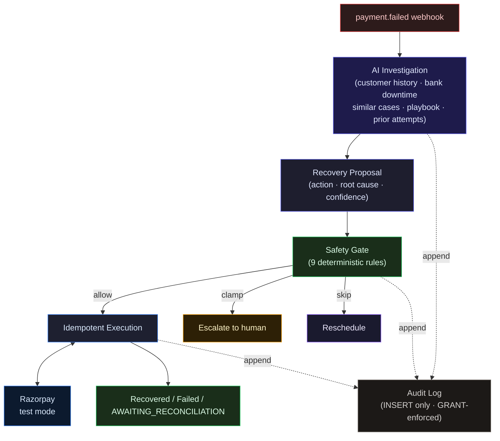

# RecoveryOps

**A decision-making and execution system for ambiguous payment failures.**

Built for Razorpay AI Buildathon 2026 — Track 3: AI Revenue Recovery.


---

## The problem

A payment gateway can detect that a charge failed. It can't tell you whether it's a transient bank
timeout (retry in 24 hours), a card that will never fund again (write off), or a risk hold a human
must approve (escalate) — Razorpay hands back the same `error_reason` for all three. The right
action depends on context, and context takes investigation. Standard dunning logic skips that
step: it retries on a fixed schedule regardless of cause, racking up decline fees, irritating
customers whose cards are genuinely broken, and missing the ones who'd have paid through a
different channel.

RecoveryOps answers one question per failed payment: **what is the right recovery action for this
specific case, and is it safe to execute?** It runs a bounded investigation, proposes one action,
and enforces a deterministic safety contract before any money moves.

```
Failed Payment
      ↓
Bounded Investigation Agent
      ↓                      ← customer history · bank downtime · similar cases · prior attempts
Recovery Proposal
 (action · root cause · confidence)
      ↓
Deterministic Safety Gate
 (9 rules, pure function)
      ↓               ↓               ↓
   Allow           Clamp to        Skip and
   execution       ESCALATE        reschedule
      ↓
Idempotent Razorpay execution
      ↓
Recovered / Failed / AWAITING_RECONCILIATION
      ↓
Reconcile / Audit / Re-plan
```

**The agent can change its mind. The safety layer cannot.**

The agent proposes a strategy. The gate holds financial authority. Every outcome is recorded in an
append-only audit log the application cannot modify.

---

## Evaluation

60 synthetic cases, same gate and executor, three strategies. The last column reruns each arm with
Razorpay's `error_reason` label blanked out:

| Strategy | Recovered | Recovery Rate | ₹ Recovered | Root-Cause Accuracy | Rate, label hidden |
|----------|----------:|--------------:|------------:|--------------------:|-------------------:|
| Fixed schedule | 20/60 | 33.3% | ₹31,480 | — (no diagnosis) | 33.3% |
| AI agent | 34/60 | 56.7% | ₹53,966 | 73.3% | **38.3%** |
| Deterministic rules | 36/60 | 60.0% | ₹56,464 | — (no diagnosis) | **33.3%** |

> **A note on when these numbers were measured.** A bug in the agent's own evidence tool
> (survivorship bias — it only ever showed cases that recovered, never ones that were escalated or
> written off) was found during a post-submission audit and fixed. All numbers on this page were
> re-measured live after that fix, after the buildathon submission deadline. The pitch video was
> recorded before this fix, against the pre-fix numbers. The fix and the before/after comparison
> are documented in [`BREAKS.md`](./BREAKS.md).

### What the result actually means

**The rules table wins on raw recovery.** That is the published number, and it stands as it came
out — this project is not going to bury its own loss in a footnote.

**It wins because it's the same 7 answers, transcribed.** [`bench/rules-arm.ts`](./bench/rules-arm.ts)
is a 6-case switch on `error_reason`, plus one second-attempt escalation rule — not new logic, but
the agent's own system-prompt playbook, copied into code. The corpus has 7 failure templates; the
playbook has 7 entries, one per template. On a fully-enumerated taxonomy, a lookup table built from
the same answer key wins, because there is nothing left for judgment to add. That is a property of
this corpus, not a general claim about rules tables beating models.

**Hide the label, and the agent still leads, by less than it used to.** `--blind-reason` replaces
`error_reason` with one generic value before any arm sees it. The rules table's switch has nothing
left to key on and collapses to a single default action for every case — its 33.3% is a fixed
schedule wearing a different name, not a rules table with the label removed. The agent holds
38.3%, still ahead, but this number *dropped* from a pre-fix 45.0% — the survivorship-bias fix
above made the labeled numbers better and this one worse, in the same corpus, from the same fix.
That is not a coincidence: blinding the label also disarms the deterministic risk-hold veto and,
now, feeds `get_similar_resolved_cases` a wider, less useful mix of outcomes than a labeled run
gets, since every case shares one blinded reason instead of being grouped by its real one. Both
are documented in [`BREAKS.md`](./BREAKS.md). The blind-mode numbers are a genuine measurement,
not a clean isolation of "reasoning without the label" — they understate every arm relative to a
labeled, non-benchmark deployment, agent included.

The agent is the only arm that can say *why* a payment failed — 73.3% root-cause accuracy against
two baselines with no concept of cause — and the only one whose reasoning doesn't evaporate the
moment the label does. Both results came from the same harness. It was built to measure where
judgment adds value, not to make the agent look good.

### Five seeds, and a blind control

Across seeds 42, 7, 13, 99, and 2024 the agent recovers **51.7–61.7%** against the rules table's
**55.0–63.3%**. The rules table's win is consistent across seeds, not a lucky draw:

| Seed | Agent | Rules |
|------|------:|------:|
| 42 | 56.7% | 60.0% |
| 7 | 51.7% | 58.3% |
| 13 | 61.7% | 63.3% |
| 99 | 56.7% | 60.0% |
| 2024 | 53.3% | 55.0% |

`--blind-reason` replaces every `failureCode` and `failureReason` with a single generic value
before it reaches any arm, leaving ground truth untouched:

| blind-reason, seed 42 | agent | fixed | rules |
|-----------------------|------:|------:|------:|
| recovery rate | 38.3% | 33.3% | 33.3% |
| ₹ recovered | ₹37,477 | ₹31,480 | ₹31,480 |
| root-cause accuracy | 30.0% | — | — |

```bash
AGENT_MODEL=google/gemini-3.6-flash npm run bench -- --size 60 --seed 42 --mock --blind-reason
```

### What the agent missed

Of the 26 unrecovered cases on seed 42:

- **16 are correct stops.** 8 risk holds (must go to a human by policy), and 8 genuinely unfunded
  accounts — 7 of which exhaust the attempt cap still diagnosed `insufficient_funds` and correctly
  escalate rather than resolve, and one (`cust_1055`) reaches the correct `unrecoverable`
  diagnosis on its final attempt, one cycle too late to matter, and is written off instead. None
  of these are misses: escalating or writing off a genuinely unrecoverable case is the intended
  outcome.
- **10 are real misses.** Mostly bank-downtime and generic-decline cases where a retry or nudge
  timed past the window before it cleared.

The largest systematic error: **all 8 genuinely-unfunded cases are diagnosed `insufficient_funds`
on every attempt but the last.** Both templates carry the same Razorpay `error_reason`. The only
separating signal is a rising failure trend in customer history, and the agent doesn't weight it
heavily enough to flip its diagnosis until it has nearly exhausted every other read — by which
point the attempt cap has already forced a stop. The stop itself is safe; the diagnosis just never
arrives in time to change the outcome.

Every case, including every miss, has its full tool-call trace in
[`bench/.cache/`](./bench/.cache/).

### Cost

The full 60-case seed-42 run above, measured from the provider's own usage blocks — not an
extrapolation from a smaller slice:

| | measured |
|---|---:|
| model calls | 486 |
| input / output tokens | 1,125,913 / 176,461 |
| cost @ $1.50 / $7.50 per M | **$3.0123** |
| cost per recovery | **$0.0886** |
| ₹ recovered per $1 of model spend | **₹17,915** |

`--mock` replays this run, and any other committed seed, at zero model calls.

---

## Recovery lifecycle

1. A `payment.failed` webhook arrives. HMAC-verified. Written into a deduplicated inbox. A new
   case is created and queued.

2. The agent runs a bounded investigation: up to 6 steps, 90-second wall-clock deadline. It calls
   up to five tools and proposes one action with a root cause and confidence score. If the deadline
   or step budget fires, it degrades to a 48-hour retry with a `null` root cause — never a guessed
   one.

3. Every proposal passes through the safety gate. The gate enforces nine deterministic rules (risk
   hold, hard decline, attempt cap, exposure cap, confidence floor, charge cooldown, contact
   cooldown, RBI contact window, write-off diagnosis check). It can clamp (escalate the action),
   skip (defer), or allow. It cannot make a proposal less cautious than what the agent proposed.

4. If allowed, the executor claims the attempt row (with a `UNIQUE idempotency_key`) before
   touching Razorpay. One key = at most one Razorpay order or payment link. A 5xx or timeout lands
   the attempt in `AWAITING_RECONCILIATION` — the executor re-checks `GET /orders/:id/payments` or
   `GET /payment_links/:id` and settles only on a genuinely captured payment. It never concludes
   from list absence.

5. Every event — proposal, gate decision, Razorpay call, outcome — is appended to
   `recovery_events`. The application DB role has `SELECT, INSERT` only. No `UPDATE`, no
   `DELETE`. Enforced at the Postgres `GRANT` level.

---

## Architecture



### Layering

```
api / worker / bench → agent · safety · execution · persistence → domain
```

`domain/` has no imports from other `src/` packages. `agent/`, `safety/`, `execution/`,
`persistence/` depend on `domain/` interfaces — not on `pg`, Razorpay SDK, or BullMQ types.
`worker/`, `api/`, `bench/` orchestrate and hold no business rules.

[`tests/architecture.test.ts`](./tests/architecture.test.ts) walks every import and asserts no
layer violations at test time.

---

## Safety guarantees

| Rule | Enforces | Overridable by human |
|------|----------|---------------------|
| Risk hold | `payment_risk_check_failed` always escalates | Yes |
| Hard decline | Card-network permanent declines never auto-retry | No |
| Attempt cap | Maximum 4 attempts per case | No |
| Exposure cap | ₹5,000 per case before human sign-off | Yes |
| Confidence floor | Agent must meet 0.6 confidence to move money | Not by the agent — see note |
| Charge cooldown | 6 hours between money-moving attempts | No |
| Contact cooldown | 24 hours between customer-facing actions | No |
| Contact window | 08:00–19:00 IST only (RBI Fair Practices Code) | No |
| Write-off gate | Cannot write off without an unrecoverable root cause | No |

The gate is a pure function. Same inputs → same output. No I/O, no state. The safety-gate test
suite (`tests/safety-gate.test.ts`) runs exhaustive property checks across 4,608 input
combinations, pinning seven of the nine rules — `contact_cooldown` and the human-override path are
covered by separate, targeted tests instead, since the property matrix fixes
`humanAuthorization: null` throughout. The gate was rewritten after a real bug: the risk-hold veto
was originally wired to the agent's *diagnosis* (which could be wrong) rather than the case's own
`failureReason` (which cannot be spoofed). That bug is documented in
[`BREAKS.md`](./BREAKS.md).

The confidence floor has two deliberate bypasses, both stamping `confidence: 1` rather than
skipping the check: a human directive (`src/worker/human-directive.ts`) authorizes a specific
action regardless of what the model would have proposed, and a degraded run (model timeout,
malformed output) is treated as *no diagnosis* rather than a *weak* one — a missing confidence
score isn't the same claim as a low one, so it isn't scored against the same floor. Both are
intentional; neither is a gap the agent can trigger on its own.

One rule is honestly weaker than the rest: the write-off gate checks whether the agent's own
`diagnosisRootCause` is `unrecoverable` — there is no independent, case-derived signal for
"unrecoverable" the way `failureReason` is for a risk hold. A misdiagnosed case can still reach
`WRITE_OFF` if the model is confidently wrong about the cause. The risk-hold and hard-decline
checks are safe from this because they OR the agent's diagnosis with a deterministic check on the
case itself — a wrong diagnosis there can only add caution, never remove it. Write-off has no such
backstop yet; it's flagged, not fixed, in [`BREAKS.md`](./BREAKS.md).

---

## Razorpay integration

RecoveryOps uses Razorpay's test mode. The integration is live: real API calls, real HMAC webhook
verification, real order and payment-link creation, real capture events. None of it is mocked
during normal operation.

Key Razorpay behaviours discovered empirically (documented in [`BREAKS.md`](./BREAKS.md)):

- `receipt` is not a unique field at Razorpay — an order create never rejects a duplicate receipt.
  `reference_id` is unique, but only on payment links; there is no equivalent for orders.
- Order list responses are eventually consistent. A 5xx mid-create cannot be resolved by checking
  the list. We re-check `GET /orders/:id/payments` for the specific artifact we created.
- Throttling comes back as a `400`, not a `429`.

The executor claims an attempt row with a `UNIQUE idempotency_key` *before* calling Razorpay, so
two workers racing the same attempt cannot both dispatch. That guarantee is not symmetric past the
first call, though: a crash that leaves an attempt unresolved for over an hour triggers a
reperform, guarded by a database advisory lock so at most one process re-checks and re-dispatches.
For a **payment link**, `reference_id`'s server-side uniqueness makes a genuine duplicate create
fail loudly rather than silently double-send. For an **order**, there is no such constraint — if
the list lookup misses an order that was in fact created (the eventual-consistency case above), the
reperform creates a second one. This is the one place idempotency at our boundary depends on
Razorpay's own guarantees rather than only ours, and it's the reason payment links are the safer
default when a case doesn't specifically need an order.

---

## What broke

15 failures documented in [`BREAKS.md`](./BREAKS.md), written as they were found. Three worth
naming here:

**Risk-hold veto was wired to the wrong signal.** The gate read `proposal.diagnosisRootCause ===
"risk_hold"` — meaning a misdiagnosed case could bypass human review. Fix: the gate now reads
`failureReason` directly from the case, independent of diagnosis. Proof:

```bash
npm test -- pipeline.integration.test.ts -t "escalates a risk-hold case"
```

**Benchmark leaked the answer key.** Failed attempt rows contained strings like `"too early,
recovers at +72h"`. The agent read prior attempts as a tool and was reading ground truth. Fix:
failed outcomes now return `"payment declined"`. The honest number dropped. The number was
republished.

**The agent's own evidence tool only ever showed it winning.** Found after the buildathon
deadline: `get_similar_resolved_cases` filtered to cases that ended `RECOVERED`, so an escalated
or written-off case was invisible no matter how many shared the same failure reason — survivorship
bias in the model's own evidence. Fix: match any terminal outcome, not just wins. The number moved
*up*, not down: see the note under [Evaluation](#evaluation).

Other entries: the escalation rail that was a dead end, the dedup that could drop a real capture,
the schema script that silently ran truncated, the cache that replayed stale recordings, the spend
cap that ran 2.1× under the real bill.

---

## What we chose not to build, and why

The build was deliberately focused on the decision-making and execution core — the parts that
are hardest to get right and easiest to get wrong invisibly. These weren't left out for lack of
time; each is a judgment call about where the hard problem actually is.

- **Outbound messaging is not dispatched.** The agent decides `CUSTOMER_NUDGE` (with channel) or
  `PAYMENT_LINK` (with rail), and the execution layer records the decision and the contact-attempt
  count — but composing and sending an actual message is a different problem with a different
  success criterion, and that criterion doesn't exist without a live customer to respond to it. It
  can't be measured against a synthetic corpus honestly, so instead of a decorative Twilio
  integration that no benchmark could validate, the time went into the part that's actually
  gradeable: whether the decision to contact, and how, is correct. The domain type and every safety
  rule that would gate a real send are already in place; wiring a provider is integration work, not
  a decision problem.
- **Synthetic corpus, by design, not by default.** 60 cases from 7 templates, not scraped or
  hand-picked. Two of them share the exact same Razorpay `error_reason` and opposite ground truth —
  one recovers by day 3, the other never funds — separated only by a rising failure trend in
  customer history, specifically so a strategy that only reads the label cannot tell them apart.
  The rules baseline wins on raw recovery anyway, because the other 5 templates are individually
  unambiguous; see [Evaluation](#evaluation) for what that result does and doesn't mean, and
  [`BREAKS.md`](./BREAKS.md) for how this corpus was built to make guessing costly.
- **Card payments only.** UPI and netbanking origination work; mandate/subscription recovery (UPI
  Autopay NPCI retry windows, NACH lapse handling) follows a different regulatory retry cadence and
  isn't modelled here.
- **Single-tenant.** One `MERCHANT_REF` per deployment. Multi-tenant row isolation is not built.
- **Token cost is process-level, not per-event.** Metered correctly for the whole server process
  (see the spend-cap fix in `BREAKS.md`); not yet written per-event into `recovery_events`. That's
  the next instrumentation step, not a design decision.
- **Concurrency is tested; throughput is not.** Executor races and webhook races have integration
  tests proving correctness under contention. High-volume load testing — how many cases per second
  the pipeline actually sustains — has not been done.

Razorpay itself is test mode throughout: the API surface, HMAC verification, order/link creation,
and capture webhooks are all live calls against real endpoints, just with test-mode keys. No real
merchant revenue is at risk anywhere in this build.

---

## Tech stack

| Layer | Technology | Why |
|-------|-----------|-----|
| Runtime | Node 22 / TypeScript (ESM) | Type safety at every boundary |
| API | Fastify | HTTP, schema validation, SSE |
| Database | PostgreSQL 16 | ACID, row-level locks, role-based grants |
| Queue | Redis + BullMQ | Durable jobs, delay scheduling |
| Agent loop | Vercel AI SDK v7 + hand-rolled | SDK standardises tool calls; the loop is owned code |
| LLM | OpenRouter / Google Gemini | Model is env-configurable; no vendor lock-in |
| Validation | Zod | Runtime schema validation at every external boundary |
| Gateway | Razorpay test mode | Real API calls, real HMAC |
| Frontend | React + Vite | Streaming hooks, fast dev loop |
| Container | Docker Compose | Single-command environment |
| Testing | Vitest | 245 tests, ESM-native |

No agent framework for the *decision loop* — the Vercel AI SDK handles tool-call transport, but
the step budget, the wall-clock deadline, the forced final-step conclusion, and the degrade-to-safe
path are owned code, not framework config, because those bounds are what's being evaluated. The
degrade rate is measured on every bench run — 0/60 on four of the five published seeds, 3/60 on
the fifth (seed 2024) — precisely because it's a real, checked behaviour, not a documented feature
nobody watches.

No ORM. The append-only guarantee is a Postgres `GRANT` held by a separate DB role with no
`UPDATE`/`DELETE` privilege — two connection pools, two roles, enforced at the database level. An
ORM doesn't prevent that grant from existing; it just adds a layer between the code and the raw SQL
that has to prove it. No DI container — dependencies are constructed once, explicitly, at
`src/main.ts` and `bench/run.ts`.

### What changes in production

The only layer running in test mode is the Razorpay gateway. These are the production swaps:

| What | Demo | Production |
|------|------|-----------|
| Razorpay | Test mode keys | Live keys; same API surface, same idempotency logic |
| Database | Docker Compose Postgres | Managed Postgres — schema and grants identical |
| Queue | Docker Compose Redis | Managed Redis (Upstash, ElastiCache) |
| LLM | OpenRouter / AI Studio key | Same providers, production keys |
| Auth | Single shared `DEMO_ACCESS_TOKEN`. Write routes always require it. Case-list and queue read routes (which carry `customerRef` PII) apply it only when configured — open-demo mode (no token set) leaves them accessible so reviewers can run without setup. Per-case detail and event endpoints are always open for the SSE-based UI. | Per-merchant JWT |
| Outreach | `CUSTOMER_NUDGE` logged, not dispatched | Messaging provider (Twilio, Exotel, MSG91) |

---

## Repository structure

```
src/            Backend — see src/BACKEND.md
bench/          Three-arm evaluation harness (agent · fixed · rules)
web/            React UI — see web/FRONTEND.md
db/             Schema and role grants
tests/          245 tests
BREAKS.md       15 documented failures, written as found
EVIDENCE.md     Every README number mapped to the exact command that reproduces it
```

---

## Quickstart

```bash
git clone https://github.com/Mithurn/RecoveryOps.git
cd RecoveryOps
cp .env.example .env
# fill: OPENROUTER_API_KEY (or GOOGLE_GENERATIVE_AI_API_KEY)
#       RAZORPAY_KEY_ID, RAZORPAY_KEY_SECRET (test mode keys)
#       RAZORPAY_WEBHOOK_SECRET

docker compose up -d          # Postgres :5434, Redis :6381
npm install
npm run db:schema             # apply schema + role grants
npm run seed:room             # seed Recovery Room from recorded bench
npm run dev                   # API :3000, web :5173
npm test                      # 245 tests
```

### Reproduce the evaluation

```bash
# Replay recorded runs — free, ~1s
AGENT_MODEL=google/gemini-3.6-flash npm run bench -- --size 60 --seed 42 --mock

# Blind-reason control
AGENT_MODEL=google/gemini-3.6-flash npm run bench -- --size 60 --seed 42 --mock --blind-reason

# Live run with token metering (~$3, ~7min) — needs an uncached seed, since a cached one
# replays for free even without --mock
AGENT_MODEL=google/gemini-3.6-flash npm run bench -- --size 60 --seed 1 --cap-usd 5.00
```

---

**Backend:** [`src/BACKEND.md`](./src/BACKEND.md)

**Frontend:** [`web/FRONTEND.md`](./web/FRONTEND.md)

**Failure log:** [`BREAKS.md`](./BREAKS.md)
