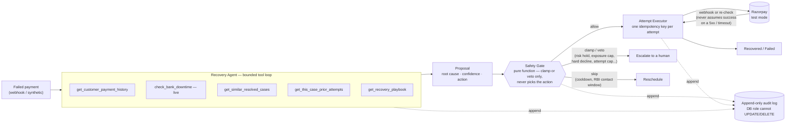

# Recovery Room

Built for the **Razorpay AI Buildathon — Track 3 (AI Revenue Recovery).**

## The problem

Every recurring merchant on Razorpay loses 5–15% of revenue to *involuntary* churn — payments
that fail for **fixable** reasons (expired card, insufficient funds at the wrong time, bank
downtime, soft decline). Today recovery is a dumb fixed retry schedule or a human.

Recovering the payment is the easy half — a fixed schedule already does that, badly. The hard
half is that every recovery action is a **regulated money action**: reattempt an expired card and
the card networks fine the merchant for it; contact a customer at 2am and that's an RBI Fair
Practices Code violation; auto-retry a risk-flagged payment and you've built a fraud tool, not a
recovery one. So this project spends most of its engineering not on the agent, but on the
deterministic fence around it — the part that decides whether the agent's judgment is ever allowed
to touch money at all.

## What it does

A failed payment enters as a case. A bounded AI agent investigates it — pulls the customer's
payment history, checks whether the issuing bank is in a **live Razorpay downtime window**, looks
at what worked for similar cases and at this case's own prior attempts — reasons out loud (you
watch it stream), and proposes one recovery move: retry now, retry at a better time, send a
payment link on a different rail, nudge the customer to update their method, escalate to a human,
or write it off.

A deterministic **safety gate** (a pure function) can only make that proposal *more* cautious — it
enforces an attempt cap, a rupee exposure limit, a charge cooldown, a separate contact cooldown, a
confidence floor, the RBI Fair Practices contact window (08:00–19:00 IST), and a mandatory
escalation on risk-flagged payments (read from the case data, not from the agent's own diagnosis).
No LLM-originated proposal can lower caution. The one deliberate exception: a recorded human
authorization on an already-escalated case can satisfy exactly two of the eight rules (the risk
hold and the exposure cap — the two that exist to force a human decision), and never the two that
carry regulatory weight (the hard-decline veto, the attempt cap) or either cooldown.

The **executor** performs the move against Razorpay test mode exactly once (one idempotency key
per attempt), and on an ambiguous response (5xx / timeout) it re-checks before concluding — so it
never double-charges. If the attempt fails, the result goes back to the agent and it re-plans.

You watch all of it: cards flowing through lanes, the agent's reasoning streaming token by token,
escalations landing in a "waiting on you" rail with working retry/redirect/write-off controls, a
real Razorpay Checkout button once an order or link genuinely exists, and a scoreboard against two
honest baselines.

## The number

One synthetic batch of 60 failed payments, using only Razorpay's own `error_reason` values and
ground-truth recoverability, run through three arms on the same gate, executor and ledger with
only the brain swapped. The corpus is deliberately adversarial: roughly a fifth of the
generic-decline cases (`card_declined` / `payment_failed`) are actually in a live Razorpay downtime
window — same error code, opposite cause; the two `insufficient_funds` templates are distinguished
only by a genuine trend in the customer's own payment history, not a fixed record count; a slice
of `card_expired` cases self-recover before contact (an issuer account-updater fixing the card),
so a wrong nudge is measurable; and a fifth tier of case amounts sits above the exposure cap, so
that guardrail fires in the batch itself, not only in a unit test. None of these signals are
visible from the error code alone, and the agent's own playbook no longer states timing numbers
that match the ground truth — it points at the tools that carry the real signal instead.

|                          | agent      | fixed      | rules table |
|--------------------------|------------|------------|-------------|
| recovered                | 33 / 60    | 20 / 60    | 36 / 60     |
| recovery rate            | 55.0%      | 33.3%      | 60.0%       |
| ₹ recovered              | ₹51,967    | ₹31,480    | ₹56,464     |
| ₹ recoverable (ceiling)  | ₹1,08,456  | ₹1,08,456  | ₹1,08,456   |
| escalation rate          | 35.0%      | 66.7%      | 40.0%       |
| over-nudge rate          | 5.0%       | 0.0%       | 1.7%        |
| mean attempts/recovery   | 1.15       | 1.30       | 1.03        |
| mean hours to recovery   | 33.3       | 38.4       | 28.2        |
| **root-cause accuracy**  | **73.3%**  | — (no diagnosis) | — (no diagnosis) |
| undiagnosed (degraded)   | 1 / 60     | —          | —           |

Seed 42, `google/gemini-3.6-flash`. Reproduce it for free, no API key — the model must be pinned
explicitly, or the reproduce command silently replays a different (and much weaker) cached model's
run instead of this table's:
`AGENT_MODEL=google/gemini-3.6-flash npm run bench -- --size 60 --seed 42 --mock`.

**The same cache key has a second trap.** `--mock` keys its recording on model/seed/size only
(`bench/.cache/agent-turns-seed<seed>-n<size>-<model>.json`), not on the corpus contents or the
agent's system prompt. Editing either after a recording exists would silently replay the old
turns against new inputs rather than erroring or re-recording — the mismatch is invisible unless
someone diffs the corpus or prompt against the cache's own timestamp. This submission's numbers
are exactly what shipped: the corpus and prompt were not touched after this recording, so nothing
here is stale, but the risk is real for future edits and is not built out of the cache key.

**Read the money rows honestly: it's close, and sometimes it loses.** The agent recovers three
fewer cases than the rules table and ₹4,497 less. Run across five seeds (42, 7, 13, 99, 2024) the
agent's recovery rate ranges **50.0%–58.3% (mean 53.7%)** against the rules table's 55.0%–63.3%,
a real, sometimes double-digit gap — not a cherry-picked win. On a templated corpus, a 6-line
switch statement on `error_reason` (`bench/rules-arm.ts`, transcribed straight from the agent's
own playbook) is a genuinely strong baseline. That finding survived two hardening passes and this
is the honest version of it. **`--blind-reason` (below) shows why that baseline is a property of
this corpus, not of the problem.**

**The recoverable ceiling.** Of the 60 cases, 44 are genuinely recoverable (the other 16 are the
8 risk-hold and 8 genuinely-unfunded cases the corpus marks unrecoverable by design) worth
₹1,08,456 — the ceiling row above. Against that denominator: the agent reaches **33/44 cases
(75.0%) and ₹51,967 (47.9% of ceiling rupees)**, the rules table **36/44 (81.8%) and ₹56,464
(52.1%)**, the fixed schedule **20/44 (45.5%) and ₹31,480 (29.0%)**. No arm comes close to the
ceiling on money, and on both rows the rules table still edges the agent — the corpus's real
separator is the *diagnosis* row, which is the one a lookup table cannot produce at all.

**What the agent proposes on the first attempt.** The table a payments reviewer actually wants:
the agent's first-attempt proposed action (pre-gate — the gate's clamps are counted separately
below) crossed with the ground-truth correct action, over all 60 cases of the seed-42 run. Ground truth
maps to: the case's recoverable-by family (retry / payment link / nudge), `escalate` for the 8
risk-hold cases (only a human may act), and `write-off` for the 8 genuinely-unfunded cases.
Derived from turn #1 of the recorded run in
`bench/.cache/agent-turns-seed42-n60-google_gemini-3.6-flash.json`; row totals are 60.

| proposed ↓ / correct → | retry | payment link | nudge | escalate | write-off |
|------------------------|-------|--------------|-------|----------|-----------|
| retry (26+2+8 = 36)    | 26    | 2            | 0     | 0        | 8         |
| payment link (7)       | 0     | 5            | 0     | 2        | 0         |
| nudge (13)             | 2     | 0            | 9     | 2        | 0         |
| escalate (4)           | 0     | 0            | 0     | 4        | 0         |

The misses are the honest part: 8 unfunded accounts drew a first-attempt retry (the hard-decline
veto and write-off rule stop most, not all, of that downstream), and 2 risk-hold cases were
nudged before the gate caught them. 44 of 60 first proposals are the correct family.

**One disclosure on the `get_similar_resolved_cases` tool: it carries a timing echo on this
corpus.** The tool is a real production shape — for a case, it returns the outcome and
hours-to-resolution of earlier-resolved sibling cases with the same failure reason, in the same
run. On a templated corpus, though, each template's ground-truth settle hour is a fixed value
(72h, 24h, 14h, 12h, 8h, 6h depending on the template), so a late-batch case can, in effect, read
its template's answer for *when* the money settles. It is agent-arm-only (the rules table never
calls tools), it does not leak the correct *action*, and it is defensible as what a real merchant
system would expose — but on a templated corpus it is a signal a heterogeneous production corpus
would blur, and it is disclosed here rather than left for a reviewer to find. Corpus
diversification is the fix, and it is future work.

**Root-cause accuracy is where the gap runs the other way, and it's consistent.** `bench/rules-arm.ts`
never diagnoses — it has no concept of *why* a payment failed. Across the same five seeds, the
agent's root-cause accuracy holds at **71.7%–75.0% (mean 73.3%)**, with the loop reaching a
diagnosis on all but 2 of 300 cases. That's measured independently of which action the agent then
chose, so one number can't launder the other, and a null diagnosis (the loop degrading before it
concludes) counts as wrong, not excluded — it used to fall back to a hardcoded `"technical"` and
score as a correct answer on two cases; that bug is fixed and gone (see `BREAKS.md`).

**What the free-tier model actually costs you.** Re-running the identical corpus and prompt on
`minimax/minimax-m3:free` — the zero-cost default — collapses: **35.0% recovery, 8.3% root-cause
accuracy (below random chance across seven categories), and the loop degrades before reaching a
diagnosis on 52 of 60 cases (86.7%).** Most of what looked like free-model competence in earlier
rounds of this project was the playbook handing it the answer, not the model reasoning. The paid
model costs roughly $1.20–1.35 per 60-case run (~500 model calls) and is the one this table uses.
`AGENT_MODEL` is an env override for exactly this reason — the model is measured, not assumed.

**Guardrails firing in this batch, not only in the property test:** `contact_window` skipped 12
nudges outside 08:00–19:00 IST, `exposure_cap` clamped 8 over-limit cases to escalation,
`risk_hold` clamped 4, `write_off_unsupported` clamped 2 write-offs the agent proposed without an
unrecoverable diagnosis. The exhaustive gate property test (`tests/safety-gate.test.ts`, 32 cases
over 4,608+ generated contexts) proves every rule *can* fire correctly; this is evidence that they
*do*, on real model output, in the measured batch.

Of the 27 unrecovered cases: 16 are stopped correctly by design (8 risk holds that must escalate
by policy, 8 accounts the corpus marks genuinely unfunded) — not misses. The other 11 are real:
mostly bank-downtime and generic-decline cases where a retry timed past the window would have
recovered the payment and didn't. The full transcript for every case, including every miss, is in
`bench/.cache/agent-turns-seed42-n60-google_gemini-3.6-flash.json` — now with the full tool-call
trace behind every diagnosis, not just the final proposal (see "What broke" below).

### Does the diagnosis actually matter, or does the rules table just know the answer key?

The rules table's edge above is a fair result, but the corpus makes it an easy one: 7 templates,
each with its own `failureReason` string, and `rules-arm.ts` is a 6-line switch on that exact
string. In live Razorpay data `payment_failed` covers a dozen unrelated causes with no reliable
mapping to the right action — which is the whole premise of the agent's own system prompt. This
batch never tests that premise, because the label the rules table branches on is, here, close to
the answer.

`bench/corpus.ts --blind-reason` replaces every case's `failureCode`/`failureReason` with one
generic value before it reaches any arm, while leaving the actual ground truth (what recovers it,
when) untouched. The rules table can no longer branch on cause and collapses to its one `default:`
guess for every case — a blind retry schedule with no diagnosis at all, which is what
`rules-arm.ts` actually degrades to without the label.

| blind-reason, seed 42     | agent      | fixed      | rules table |
|----------------------------|------------|------------|-------------|
| recovered                  | 27 / 60    | 20 / 60    | 20 / 60     |
| recovery rate               | 45.0%      | 33.3%      | 33.3%       |
| ₹ recovered                 | ₹42,473    | ₹31,480    | ₹31,480     |
| escalation rate              | 30.0%      | 66.7%      | 66.7%       |
| root-cause accuracy          | 31.7%      | — (no diagnosis) | — (no diagnosis) |

**With the error code hidden, the rules table collapses from 60.0%/₹56,464 to a dead tie with the
fixed schedule at 33.3%/₹31,480** — it has no other information, so a "diagnosis" table with no
diagnosis degrades to exactly a calendar. **The agent also drops — 55.0%→45.0% recovery,
73.3%→31.7% root-cause accuracy** — because the case brief hands the model the error code too, so
part of its edge in the labeled table was reading the same label, not pure tool-driven reasoning.
It still beats both non-diagnosing arms by a real margin (11.7pp recovery, ₹10,993) on nothing but
customer history, the live downtime feed, similar-case outcomes and prior attempts. That is the
honest measurement: diagnosis is worth something even blind, just less than the labeled table
suggested, and a lookup table is worth nothing at all once the one input it needs is gone.
Reproduce with `AGENT_MODEL=google/gemini-3.6-flash npm run bench -- --size 60 --seed 42 --mock --blind-reason`.

**This run also surfaced a real gap, not just a headline number.** `isRiskHold` (`src/domain/case.ts`)
— the deterministic, case-data veto that forces every risk-flagged payment to a human, independent
of the agent's own diagnosis — reads the exact same `failureReason` string this experiment blinds.
With it blinded, the veto never fires (`risk_hold` clamp count: 4 in the labeled run, 0 here), and
4 of the 8 genuinely risk-holding cases were written off by the agent's own (wrong, "unrecoverable")
diagnosis instead of escalating to a human — the `write_off_unsupported` gate only checks that the
agent *claimed* an unrecoverable diagnosis, not that the claim is true. In this build risk-hold
status is carried in the same field as the diagnostic hint, which a real Razorpay integration would
not do (risk-check failure is its own signal on the payment entity, not folded into the display
error string) — but it means `--blind-reason` is an evaluation tool for the diagnosis question
only, not a mode safe to run unattended, and the coupling itself is a real finding, logged in
`BREAKS.md`.

## What's real, what's stubbed, what's simulated

Razorpay test mode does not decline a card on demand, so the **incoming failure stream is
synthetic** (modeled from real error codes). Everything downstream of a failure is real unless
stated otherwise here:

- **The recovery actions are real** — real Orders, real Payment Links, real payment IDs, a real
  Razorpay Checkout widget in the room UI once an order or link genuinely exists (`GET
  /cases/:id/pay` resolves this server-side, excluding any bench/seeded reference, so only the
  publishable key ever reaches the browser). Verified live: a genuinely captured payment
  (`pay_TXjLb8zQlnk3Wj`, ₹1,499, netbanking) through the full stack — agent → gate → executor →
  a real signed Razorpay webhook delivered through a public tunnel → the case flipping to
  RECOVERED — independent of the bench evaluation entirely.
- **`recovered_paise` is summed from three clearly separated sources, never blended**: **live** (a
  real Razorpay capture), **bench** (ground-truth resolution for the evaluation — the order is
  still created for real; only the authorization result is simulated), and **sim** (the demo's own
  "simulate payment" button, `POST /cases/:id/simulate-capture` — builds a real HMAC-signed
  `payment.captured` webhook through the exact same handler a live delivery hits, but self-signed,
  payment id always prefixed `pay_sim_`, kept only as the offline fallback when no tunnel is
  running).
- **`CUSTOMER_NUDGE` is a labeled stub, not a channel.** No email/SMS/WhatsApp provider is wired.
  The executor calls a `NotificationPort`; the shipped adapter (`LoggingNotifier`) records a
  `NUDGE_QUEUED` event with `delivered: false` and the attempt resolves — it does not loop forever
  re-checking a delivery that never happens, and nothing downstream ever reads it as sent. Wiring
  a real provider is a connector integration, not a recovery decision, and is out of scope here.
- **The stop registry is in-memory, per-process.** The emergency brake and per-case stop
  (`src/worker/stop-registry.ts`) live in the worker process's own memory, not Redis or Postgres.
  On this project's target — a single-node demo deployment — that's correct: a stop request and
  the worker handling it are the same process, so it always lands. A hypothetical multi-node
  deployment would need shared state instead, since a stop-all request would only halt the node
  that received it.
- **The human decision on an escalated case is real and executes.** Clicking retry/redirect on a
  "waiting on you" case records a `HUMAN_DIRECTIVE` in the append-only log; the next pipeline turn
  reads it, performs exactly that action instead of re-running the agent, and the gate still runs
  on it — a human can authorize past a risk hold or the exposure cap, never past the hard-decline
  veto or the attempt cap.
- **`RETRY_SCHEDULED`'s `atHoursFromNow` governs re-attempt spacing, not the first attempt's
  timing.** It decides the delay before the *next* attempt if this one fails, but the order for
  the current attempt is created immediately either way. A production version would hold the
  charge itself until the scheduled time; this build always creates it now, since deferring it
  changes the worker's execution model in ways worth doing deliberately, not under a deadline.
- **One merchant, one currency, card only.** No UPI/netbanking origination, no subscriptions or
  mandates, no multi-tenancy. Said plainly rather than left for a reviewer to find.

## Architecture

The recovery loop, one failed payment at a time — the agent proposes, the gate can only add
caution, the executor is the only thing that ever touches Razorpay:



No LLM-originated proposal can lower caution, move money twice, or move it past the exposure cap
or attempt cap — see "What it does" above and `src/safety/safety-gate.ts` for exactly what the
gate can and cannot do.

Module dependency direction is separately enforced (not just this data-flow diagram):

```
api / worker / bench   →   agent · safety · execution · persistence   →   domain
```

Arrows point down, and it's enforced, not just documented: `tests/architecture.test.ts` walks
every import under `src/` and asserts `domain/` depends on nothing but `zod`, `safety/` depends
only on `domain/`, no adapter layer imports upward into `worker/`/`api/`/`bench/`, and `pg` /
`bullmq` / `ioredis` stay confined to the layer that owns them. It caught a real violation
(`execution/webhook-handler.ts` importing `bullmq` directly) the first time it ran — fixed with a
`CaseEnqueuer` port, the same pattern used everywhere else here.

- **Ports & adapters.** `src/domain/ports.ts` defines what the outside world must provide
  (`CaseRepository`, `EventLog`, `PaymentGateway`, `NotificationPort`, `CaseEnqueuer`); Postgres,
  Razorpay, BullMQ and the logging notifier are adapters wired only in `src/main.ts`.
- **Anti-corruption layer.** `src/domain/gateway.ts` is explicitly "our vocabulary for the payment
  gateway, not Razorpay's" — adapters translate at the boundary, so a Razorpay API shape never
  leaks into a domain type.
- **Decorators**, not conditionals, for cross-cutting concerns: `LanePublishingCaseRepository` and
  `PublishingEventLog` wrap the Postgres repositories to mirror every write onto the live SSE
  stream, without either repository knowing a stream exists.
- **Optimistic concurrency**: every lane transition is a compare-and-set (`moveLane(id, from, to)`)
  against the lane the caller last read, so two concurrent workers can never both win a turn on
  the same case.
- **Claim-before-side-effect**: the attempt row (with its unique idempotency key) is inserted
  *before* any Razorpay call, so a crash mid-flight leaves a durable claim, never a lost or
  doubled attempt.
- **Least privilege at the grant, not the convention**: `recovery_events` and `razorpay_webhooks`
  are append-only because the database role literally cannot `UPDATE`/`DELETE` them
  (`db/schema.sql`) — proved live by a button in the room UI that connects as the app role and
  shows the database refusing the edit.
- **Safety as a pure function**: `src/safety/safety-gate.ts` takes a proposal and a context, and
  returns a decision. No I/O, no side effects, exhaustively property-tested (4,608+ generated
  contexts) rather than sampled.

**12 runtime dependencies, deliberately.** No agent framework (an earlier version of this project
used one; the step budget, deadline, forced conclusion and degrade-to-safe are what this
submission is judged on, so they're owned code, not framework configuration — see `BREAKS.md`). No
ORM (would cost the DB-grant append-only proof). No DI container (`src/main.ts` is 130 legible
lines). No state machine library (nine lane constants plus compare-and-set already say it). No
Result-type library (`GatewayRejectedError` vs `GatewayUnavailableError` is the actual insight; a
monad on top of it is style). Each dependency earns its place; nothing was added to look
sophisticated.

- `src/domain/` — pure types and rules, zero I/O.
- `src/safety/safety-gate.ts` — the fence. Nine rules total: risk hold, a hard-decline veto on any
  automatic reattempt (Visa/Mastercard fine merchants for reattempting a decline that won't clear
  on its own), the attempt cap, the exposure cap, the confidence floor, the charge cooldown, a
  separate contact cooldown, the RBI contact window, and the write-off-needs-diagnosis rule. A
  recorded human authorization can lift exactly two of the nine.
- `src/agent/` — a hand-rolled bounded loop on the Vercel AI SDK (no agent framework). Bounded by
  a step budget, a wall-clock deadline, a forced conclusion on the last step, and degrade-to-safe:
  a missing / malformed / timed-out proposal returns a scheduled retry with a `null` root cause,
  never a guess and never a throw. The merchant's default-move-per-cause table lives behind a tool
  call (`get_recovery_playbook`), not in the system prompt — the model has to choose to consult
  it, and the notes describe mechanism, not timing, so the investigation is real work, not
  retrieval.
- `src/execution/` — the only code that talks to Razorpay.
- `src/persistence/` — the only code that talks to Postgres.
- `src/worker/` — BullMQ: case → agent → gate → executor → record → schedule next.
- `bench/` — the three-arm evaluation (agent, fixed schedule, rules table).

## Run it

```bash
cp .env.example .env      # OPENROUTER_API_KEY or GOOGLE_GENERATIVE_AI_API_KEY + Razorpay test keys
docker compose up -d      # postgres :5434, redis :6381
npm install
./start.sh                # infra + schema + seed + API (:3000) and web (:5173)
npm test                  # 209 tests (needs docker compose up)

# the evaluation — agent, fixed schedule, and the rules table, on one batch
AGENT_MODEL=google/gemini-3.6-flash npx tsx --env-file=.env bench/run.ts --size 60   # records
AGENT_MODEL=google/gemini-3.6-flash npx tsx --env-file=.env bench/run.ts --size 60 --mock   # replays, free
AGENT_MODEL=google/gemini-3.6-flash npx tsx --env-file=.env bench/run.ts --size 60 --mock --blind-reason

# seed the live demo queue
npx tsx --env-file=.env bench/seed-demo.ts
npx tsx --env-file=.env bench/smoke.ts                 # one real agent run against a known case
```

## Stack

Node 20+ / TypeScript (ESM) · Fastify · PostgreSQL 16 · Redis + BullMQ · a hand-rolled bounded
agent loop on the Vercel AI SDK (`ai` v7) · `@openrouter/ai-sdk-provider` · Zod at every boundary ·
Razorpay test-mode APIs and Checkout · React + Vite · Docker Compose · Vitest.

## What broke, and how we got out

The submission form's last question, kept as a live log rather than reconstructed at the end — the
full log is [`BREAKS.md`](./BREAKS.md). The short version: an earlier version of this project was
an authorization layer for agentic payments; we measured its AI component performing worse than
plain deterministic rules and pivoted to recovery. The bench went through several rounds of
self-audit before shipping, each one lowering a number rather than protecting it: handing the
agent its own ground truth through a too-informative failure detail (found, fixed, the honest
number dropped and the agent briefly *lost* to the fixed schedule); grading an action at the
instant it was decided rather than the hour it would settle, which specifically punished the agent
for acting early; the live downtime tool matching on payment *method* instead of the specific
issuer, so the audit trail carried confidently-worded but fabricated claims about named banks being
down; and, in this final pass, a fallback constant (`?? "technical"`) that let a degraded
investigation's missing diagnosis silently score as a correct one — found in a final self-audit the
day before submission, root-cause accuracy corrected 71.7%→68.3% on the spot, then re-measured
honestly at 71.7-75.0% once the model itself stopped being the thing degrading. Full detail,
including the escalation rail that used to be a dead end and the guardrail that was quietly
disarmed by its own bug, is in `BREAKS.md`.
